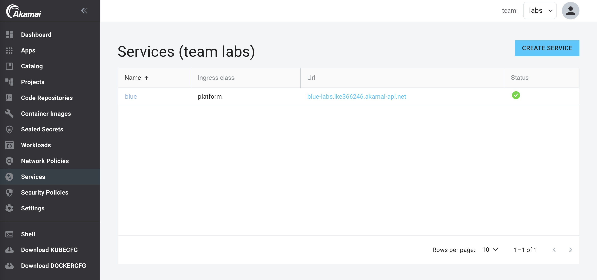

When you have deployed your application using the Workloads feature, you will probably like to expose it publicly. In this lab we'll create a Service in APL to expose your application publicly. When you create a Service, APL will create the Istio virtual service and configure ingress for your application.

## Create a Service

1. In the left menu panel under click `Services` then click on `Create Service`:

2. Select the `blue` service of the Workload we created in the previous lab:

3. Under `Exposure Ingress`, select `External` and use the default configuration:

4. Click `Submit`.

5. Click `Deploy Changes`.

You will see your service in the list of Services:

Click on the URL and see the blue application publicly exposed.