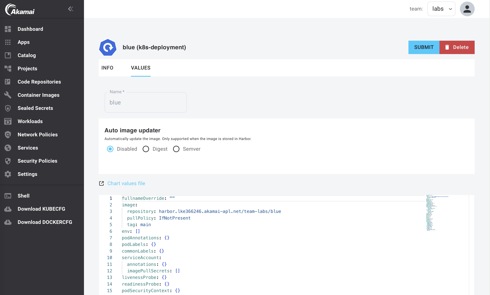
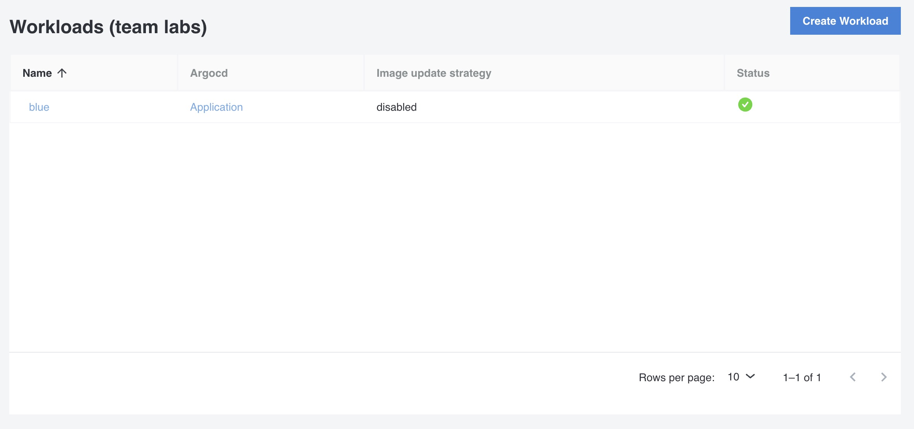
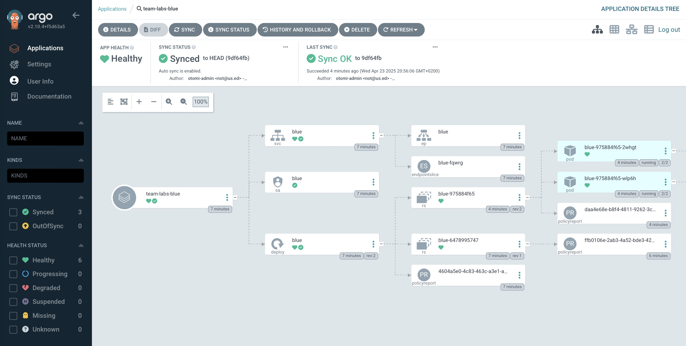

In the previous lab we deployed a workload using Argo CD with a BYO manifest and we explored the Catalog. In this lab we'll create a workload (a Kubernetes Deployment) using the Catalog and the Workload feature.

## Create a Workload from the Catalog

Before creating a workload from the Catalog, we'll need the `repository` and `tag` of the image to use. Go to the list of Builds and add the `repository` of the `blue` build to your clipboard. Remember that the tag is `latest`.

You can create a workload from the developer catalog:

1. Go to `Catalog` in the left menu and click on the `k8s-deployment`template
2. Click on `Values`
3. Add the Name `blue`
4. Leave the `Auto image updater` to `Disabled`
5. In the workload `values`, change the following parameters:

```yaml
image:
  repository: <paste from clipboard>
  tag: latest
```



6. Click `Submit` and then `Deploy Changes`

Otomi will now create all the needed Argo CD resources to deploy your workload. 

7. Click on `Workloads` in the left menu. You will now see a list of all Workloads and there status:



8. In the workloads list, click on the `Application` link of your workload to see the status of your workload in Argo CD:



The values of a workload can be changed at any time. Changes will automatically be synchronized.
