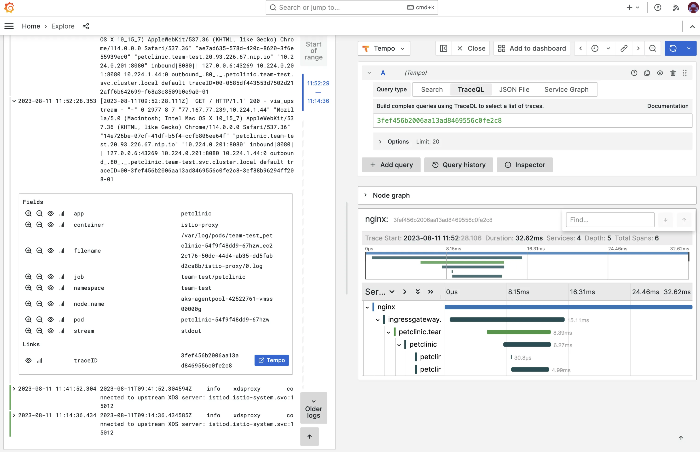
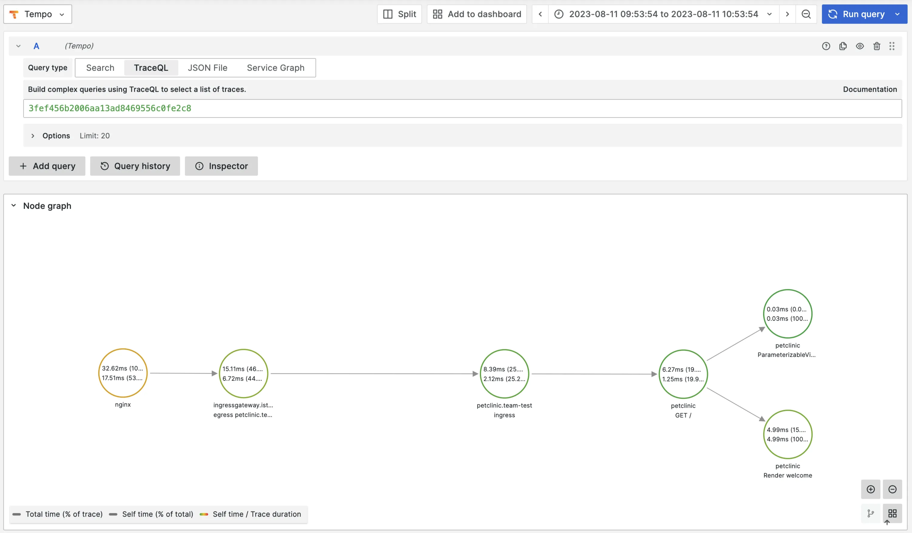

In order to make a system observable, it must be instrumented. Language specific implementation of OpenTelemetry provides a way to instrument your application without touching your source code. In this lab we're going to instrument a Java application.

## Prerequisites

For this lab it is required to:

- Enable `Tempo`
- Enable tracing for `Istio` and `Nginx Ingress`

## Build an image from source code

For this lab we're going to use the [Spring PetClinic Sample Application](https://github.com/spring-projects/spring-petclinic). Follow these steps to build an image from source code:

:::note
Using a Gitea repository is not required. You can also build using public repositories.
:::

1. Create a new repo called `petclinic`
2. Clone the Spring PetClinic Sample Application:

```bash
git clone https://github.com/spring-projects/spring-petclinic.git
cd spring-petclinic
```

3. Mirror the Spring PetClinic Sample Application to your `petclinc` repo:

```
git push --mirror https://gitea.<your-domain>/<your-user-name>/petclinic.git
```

4. Go to `Builds` in the left menu and click `Create Build`
5. Fill in the Build name `petclinic`
6. Choose `Buildpacks`
7. Fill in the `Repo URL` with the `petclinic` Gitea repo you created
8. Click `Submit`

## Create a workload from the developer catalog

Go to the list of Builds and add the repository of the `petclinc` build to your clipboard. Remember that the tag is latest.

1. Go to `Workloads` in the left menu and click on `New Workload`
2. Add the Name `petclinic` for the workload
3. Select `otomi-quickstart-k8s-deployment-otel` from the catalog
4. Leave the `Auto image updater` to `Disabled`
5. In the workload `values`, change the following parameters:

```yaml
image:
  repository: <paste from clipboard>
  tag: latest
```

Because we're deploying a Java application here, maybe also change the resources:

```yaml
resources:
  limits:
    cpu: 500m
    memory: 1Gi
  requests:
    cpu: 300m
    memory: 256Mi
```

6. Click `Submit`

Now click on `Deploy Changes`

## Expose the service

- In the left menu panel under click `Services` then click on `Create Service`
- Select the `petclinic` service
- Under `Exposure Ingress`, select `Ingress` and use the default configuration
- Click `Submit`
- Click `Deploy Changes`

## See traces

To be able to see traces, we'll first need to generate some requests. Click on the URL of the `petclinic` service and generate some requests.

To see traces, you'll first need to find a `TraceID` of a trace. Go to `Apps` in the left menu and then click op `Loki`. Select the label `App` and select value `petclinic`.

Click on a log entry of a request. Note that the requests are logged by the Istio Envoy proxy. You will now see a link to the full trace in Grafana Tempo. Click on it.

:::note
If you don't see any traces, check and see if the pod runs the `ghcr.io/open-telemetry/opentelemetry-operator/autoinstrumentation-java:1.26.0` container. Sometimes the pod starts before the `Instrumentation` resource has been created. If this is the case, restart the Pod
:::



And when you click on the Node graph, you’ll see the complete flow:


