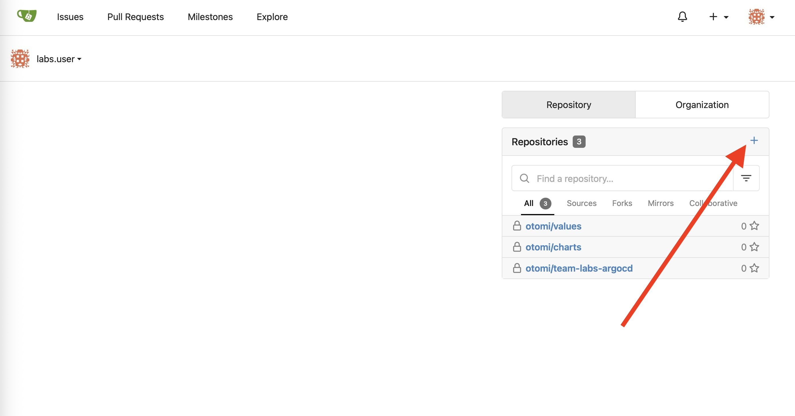

As a developer you'll need a Git repository for your code. Most organizations will probably have a central code repository like Gitlab, or use Github. But if you don't, Otomi has you covered. Otomi includes a complete self-hosted Git solution called Gitea.

As a team member, you can create and manage your own repositories.

:::info
Team members first have to sign in to Gitea (using OpenID), after which they are automatically added to the correct team.
:::

:::info
The `otomi-admin` account is unable to login with OpenID, this account needs to login with the user/password login form.
:::

In the labs we'll be using a Team called `labs` and a user called `labs-user`.

## Using a Git client

Gitea in Otomi only supports HTTPS for Git authentication. To connect to Git using HTTPS you'll first need to add a password to your account in Gitea:

- Sign in to Gitea using OpenID
- Click on your account (top right) and then click `Settings`
- Fill in a password in the `Account` tab

After adding a password, you can now authenticate using your username (labs-user) and the password created in Gitea.

## Create the private repository

In the apps section in Otomi console, you'll see an app called Gitea. Click on it.


Now follow these steps:

- Click on `Sign In` with OpenID


- Click on `+ New Repository`



- Add the name `blue` for the repository
- Optional: Enable `Initialize Repository`
- Make Repository Private
- Click on `Create Repository`

Your repo is now ready to be used!


Add the following 2 files to the repository:

Add `Dockerfile`:

```Dockerfile
FROM nginxinc/nginx-unprivileged:stable
COPY blue.html /usr/share/nginx/html/index.html
EXPOSE 8080
```

Add `blue.html`:

```html
<!DOCTYPE html>
<html>
  <head>
    <meta charset="utf-8" />
    <title>Sample Deployment</title>
    <style>
      body {
        color: #ffffff;
        background-color: blue;
        font-family: Arial, sans-serif;
        font-size: 14px;
      }
      h1 {
        font-size: 500%;
        font-weight: normal;
        margin-bottom: 0;
      }
      h2 {
        font-size: 200%;
        font-weight: normal;
        margin-bottom: 0;
      }
    </style>
  </head>
  <body>
    <div align="center">
      <h1>Welcome to Blue</h1>
    </div>
  </body>
</html>
```

In the following labs we are going to use the `blue` repository, but we'll also need a `green` repository. Create the `green` repository and add the 2 files, but change `blue` into `green`.