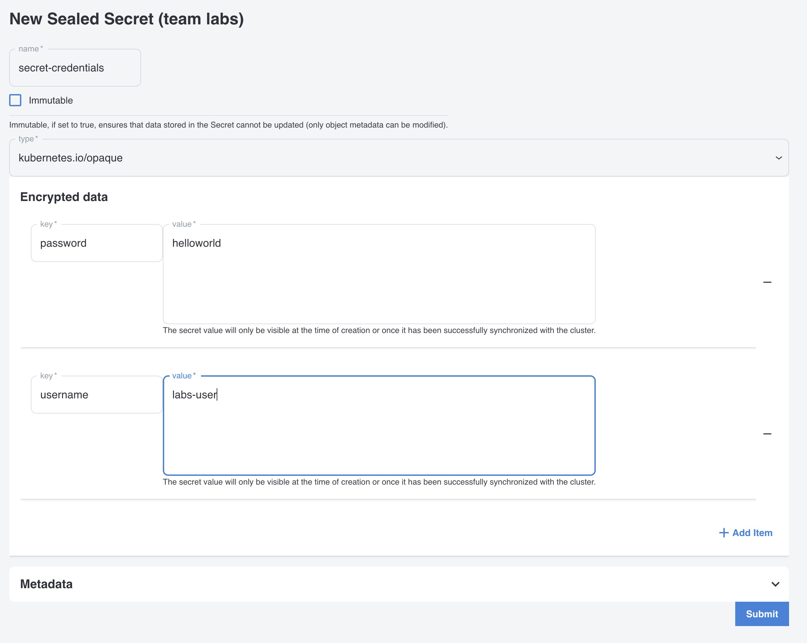
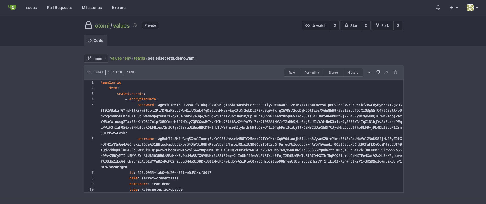

In this lab we will create sealed secrets and see how to securely sensitive information in git repository.

## Enabling Sealed Secrets

As an `Admin` go to the `Apps` panel and activate `sealed-secrets`, afterwards click the `deploy` button.
If you are not and `Admin` then ask your `Admin` to enable the `sealed-secrets` application.

## Creating a Sealed Secret

To create a sealed secret, on the team overview click on the `Sealed Secrets` in the sidebar and select the `Create SealedSecret`. This will take you to the page where you can create a sealed secret.


To configure the sealed secret fill in a name for your secret and the desired namespace. 
Afterwards you can add the `secret` data that you want to store in the sealed secret. 
The secret data is stored as 'key' 'value'. In the example below we created a secret named 'secret-credentials' in the namespace 'team-demo'. 
The secret has the key values `password=helloworld` and `username=labs-user`. Now click on `submit` and `Deploy Changes`.



Once the secret is created you cannot see the values anymore.


## Checking the repository

Now go to Gitea and check the otomi/values repository. You will see that under `values/env/teams/sealedsecrets.<team-name>.yaml` the secret is stored in yaml, but the values are encrypted.



## Checking the cluster

The only way to see the values of the secret is to have access to the cluster and decrypt the secret. The secrets are there stored as base64 encoded values.

```bash
kubectl get secret secret-credentials -o yaml -n team-demo
```
This wil return the secret in yaml format. The values are stored as base64 encoded values.
```yaml
apiVersion: v1
data:
  password: aGVsbG93b3JsZA==
  username: bGFicy11c2Vy
kind: Secret
metadata:
  creationTimestamp: "2024-04-11T14:33:37Z"
  name: secret-credentials
  namespace: team-demo
  ownerReferences:
  - apiVersion: bitnami.com/v1alpha1
    controller: true
    kind: SealedSecret
    name: secret-credentials
    uid: 4ead6ffe-f1e9-4b30-91d7-94011af12452
  resourceVersion: "4085462"
  uid: 48d84c95-0eb1-47d8-acae-b0d3d7474921
type: kubernetes.io/opaque
```
If you want to decode the secret you can use base64 decode:

```bash
kubectl get secret secret-credentials -n team-demo -o jsonpath="{.data.password}" | base64 --decode
helloworld
```
