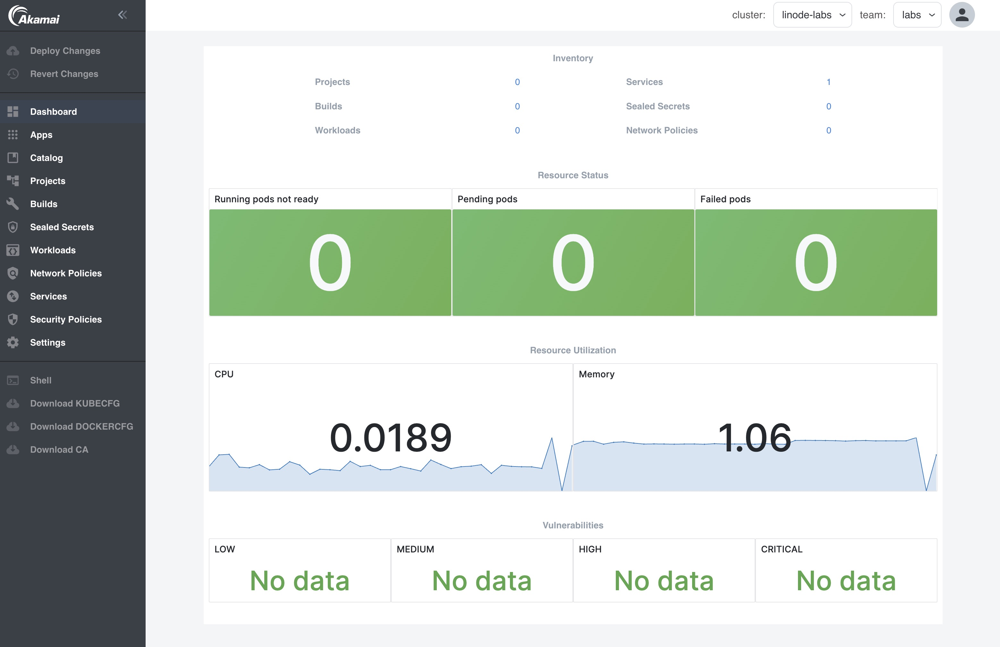

## Prerequisites

1. DNS is configured. See [here](get-started/installation/overview.md). Not needed when using the LKE automatic installation.

2. Prometheus is enabled on the platform level.

2. Enable additional App on the platform level to support the following labs:

| Lab                                         | App                                 |
|---------------------------------------------|-------------------------------------|
| Create container images                     | Harbor                              |
| Trigger builds                              | Harbor                              |
| Manually Push images to Harbor              | Harbor                              |
| Scan running containers for vulnerabilities | Prometheus, Grafana, Trivy Operator |
| View container logs                         | Loki, Grafana                       |
| Tracing with Open Telemetry                 | Loki, Otel, Tempo                   |
| Create a RabbitMQ cluster                   | RabbitMQ                            |

:::info
For the [Tracing with Open Telemetry](use-otel.md) Lab, tracing needs to be configured in the `Istio` and `Nginx Ingress` apps.
:::

3. A team called `labs` is created with `Dashboards` and `Alerts` enabled. See [here](docs/for-ops/console/teams.md) how to create Teams.

4. A user account is created and added to the `labs` Team. In the labs we'll be using the user `labs-user@labs.com`. See [here](docs/for-ops/console/usermgnt.md) how to create users and assign them to Teams.

:::note
An organization in Gitea is automatically created for each Team. Only members of the Team are added to the `Owners` group of this organization. When using the `platform-admin` account, make sure to add your account to the `Owners` group of the Team's organization in Gitea.
:::

5. The Kube API URL has been added to the [Cluster Settings](../../for-ops/console/settings/cluster.md). Select the `platform` view and click on `Settings` in the left menu. Then click on `Cluster`. When using LKE: You can find the Kube API URL in the Summary of your LKE cluster. Here it is called the `Kubernetes API Endpoint`. You can remove `:443` at the end.

## Sign in to the Console

- Go to the provided URL. The URL will look like this: https://console.yourdomain.com

- Sign in with the created user account.

After sign in, you will see this page (with Dashboards enabled):

