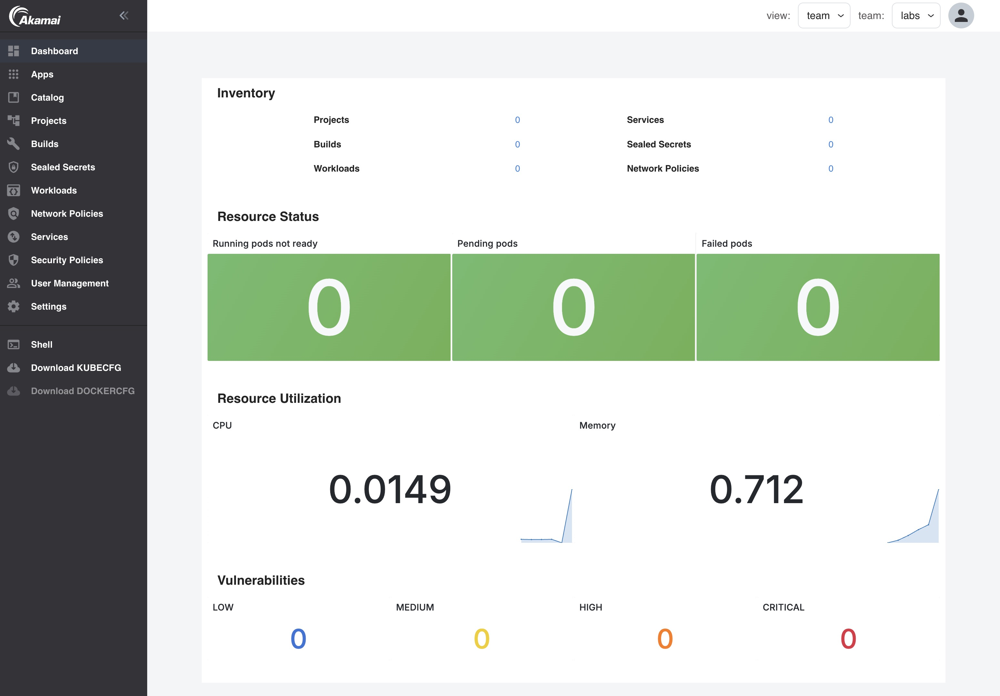

## Prerequisites

1. DNS is configured. See [here](get-started/installation/overview.md).

2. Platform Applications that are required for the following labs are enabled:

| Lab                                         | App                                 |
|---------------------------------------------|-------------------------------------|
| Build images                                | Harbor                              |
| Trigger builds                              | Harbor                              |
| Push images to harbor                       | Harbor                              |
| Scan running containers for vulnerabilities | Prometheus, Grafana, Trivy Operator |
| View container logs                         | Loki, Grafana                       |
| View container metrics                      | Prometheus                          |
| Monitor services                            | Alertmanager                        |
| Using custom metrics                        | Prometheus                          |
| Tracing with Open Telemetry                 | Loki, Otel, Tempo                   |
| Create a RabbitMQ cluster                   | RabbitMQ                            |

For the [Tracing with Open Telemetry](use-otel.md) Lab, tracing needs to be configured in the `Istio` and `Nginx Ingress` apps.

3. A team called `labs` is created with `Alertmanager` activated. See how you can create teams on: [Platform - Teams](docs/for-ops/console/teams.md).

4. A user account is created and added to the `labs` Team. In the labs we'll be using the user `labs-user@example.com`. See how you can create users on: [Platform - User Management](docs/for-ops/console/usermgnt.md).

## Sign in to the Console

- Go to the provided URL. The URL will look like this: https://console.yourdomain.com

- Sign in with the created user account (or when OIDC is configured, use your existing corporate AD account)

After sign in, you will see this page (with grafana enabled):

