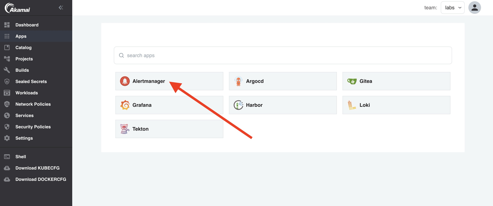

When your application is deployed and exposed, you probably would like to get an alert when your application (service) is not available anymore. To automatically monitor you applications for availability, a probe to monitor your service is automatically configured.

In this lab we'll scale down the replicas of a workload to see how this works.

## Check alerts in Alertmanager

1. In the left menu, click on `Apps` and open `Alertmanager`.



2. As you can see, there are currently no alerts:


## Scale down the replicas of a Workload

In the lab [Expose Services](expose-services) we exposed the `blue` service. Let's scale down the `blue` Workload and see what happens:

1. Go to `Workloads` in the left menu and click on the `blue` Workload.

2. Click on the `Values` tab.

3. In the workload `values`, set the `replicaCount` to `0`:

```yaml
replicaCount: 0
```

4. Click `Submit`.

5. Click `Deploy Changes`.

## Check the alerts again

Go back to Alertmanager and see if there are new alerts. You should see the following alert:


Click on `+Info`:


The Target `https://blue-labs.labs.try-apl.net/` is down!