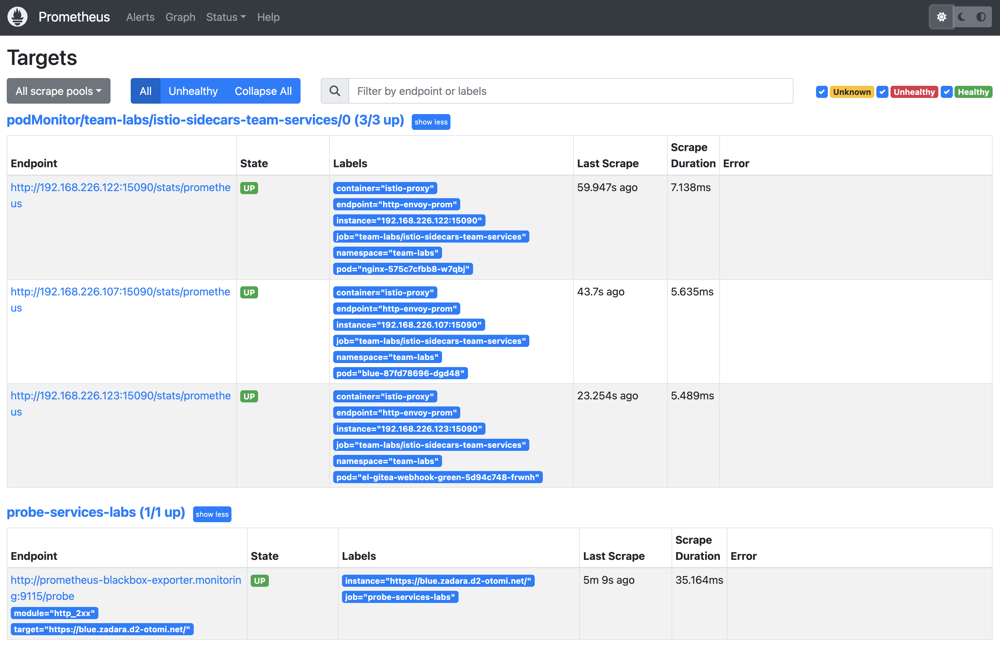
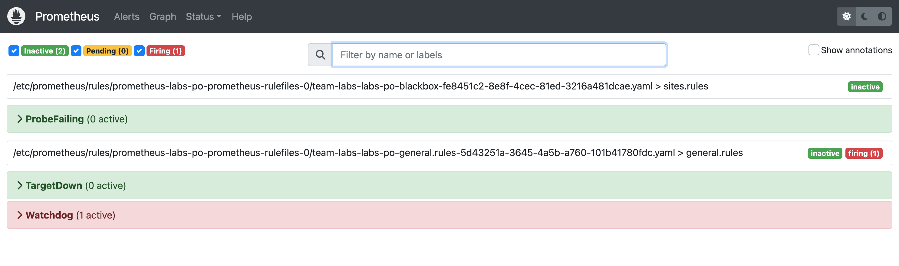

When your application is deployed, you would of course like to get an alert when you application (service) is not available anymore. To automatically monitor you applications for availability, a prope to monitor your service is automatically configured.

## Monitor your application for availability

1. [Create a Service](expose-services.md) for your app. The service can have an Exposure ingress of type `Cluster` or `Ingress`.

2. Open Prometheus:

3. In Prometheus, Go to `Status` and click on `Targets`:

In the list of targets you will see:

- The `PodMonitor` endpoints of the `istio sidecars` os the Team Workloads

- The `Probes` of all the Team services that are exposed

4. In Prometheus, Go to `Alerts`:

In the alerts you will see an (inactive) alert for `ProbeFailing`. If the `State` of a Servive Probe is `Down` the Prometheus `Rule` for this alert will fire. When alertmanager is enabled, and an alert notification receiver is configured, you will automatically receive an alert when your exposed Service is down.