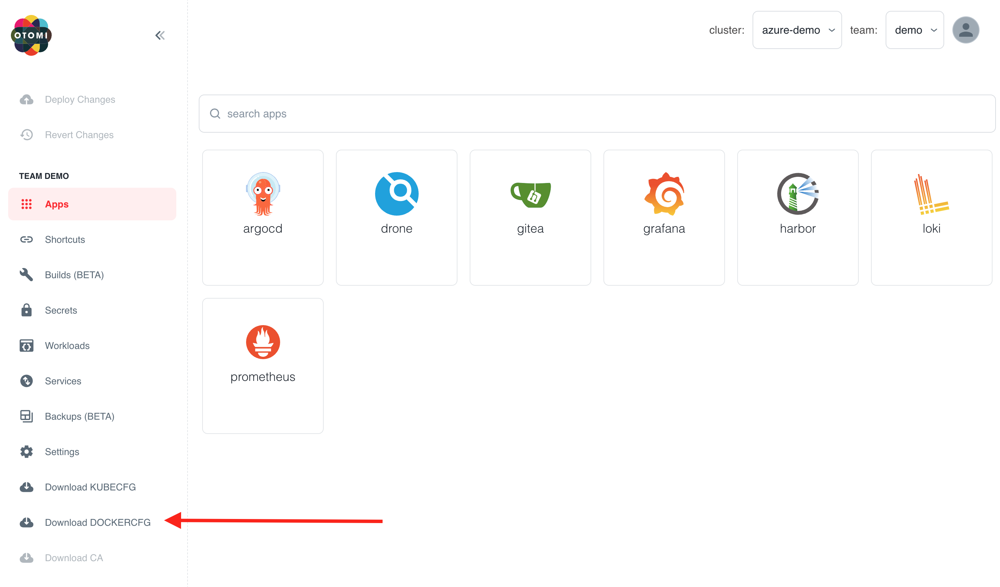

:::info
For this lab, Harbor needs to be activated and the cluster needs to be configured with trusted certificates (like Let's Encrypt using production certificate).
:::

## Login to Harbor

To be able to push images to Harbor, you'll need a robot account with push permissions. APL offers teams with a self-service option to download the Docker config for their team's private registry in Harbor. In the left menu you will see the option `Download DOCKERCFG`. Click on it to download the credentials.



When you have downloaded the docker config then run `docker login`:

```bash
docker login -u 'otomi-team-<team-name>-push' -p <token> harbor.<your-domain>
```

Build and tag your image:

```bash
docker build -t harbor.<your-domain>/<team-name>/<image-name>:<tag> .
```

Push the image to Harbor:

```bash
docker push harbor.<your-domain>/<team-name>/<image-name>:<tag>
```
