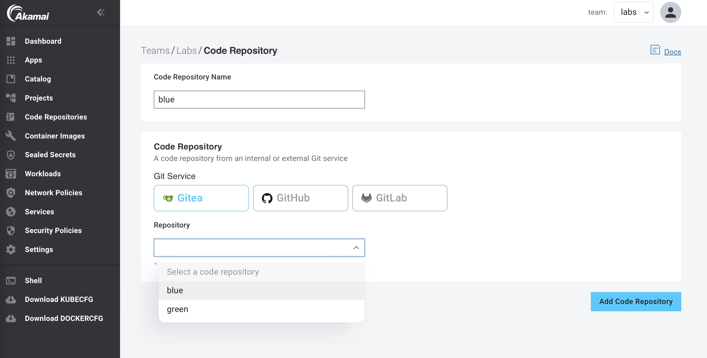
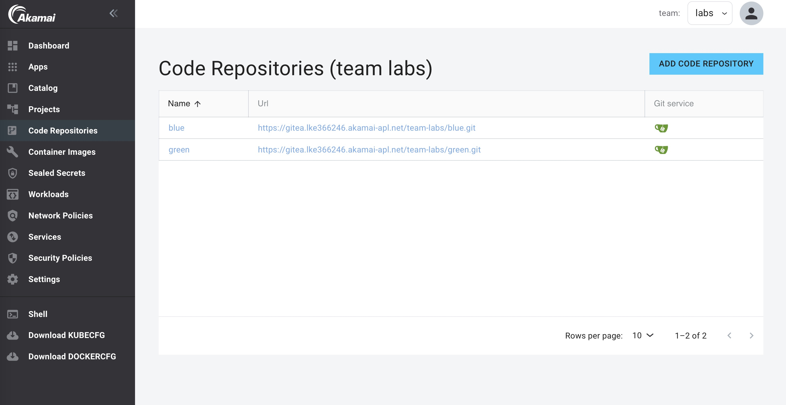

In the previous lab we created 2 code repositories. The `blue` and the `green` repositories. Before we can start creating container images using these repositories, we first need to register them in App Platform.

1. Sign in to the App Platform Console

2. In the left menu, click on `Code Repositories`.

3. Click on `ADD CODE REPOSITORY`.

4. Provide a name for this code repository. The name will be used to identify the code repository in App Platform. You can only use the name once within a Team. We are going to use the name `blue` for this code repository.

5. Select `Gitea` for the Git service (default)

6. Select `blue` from the `Repository` drop-down list:

7. Click `Add Code repository`

Follow the above steps again, but now for the `green` repository.

You should now have 2 Code Repositories in your Team:

