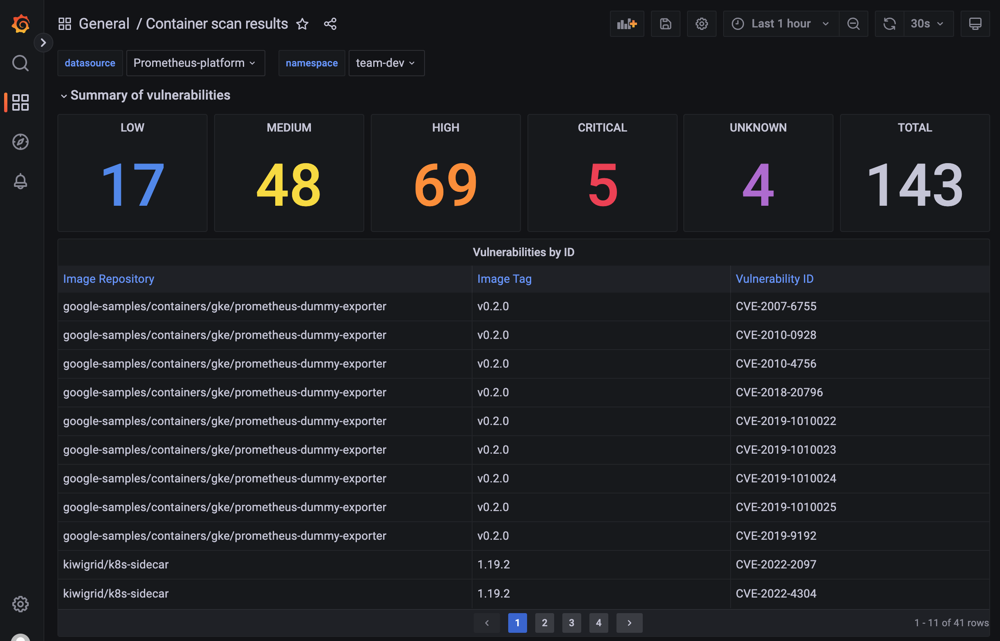

:::important
Trivy Operator is not supported when App Platform is deployed directly through LKE (not manually installed) or when running Kubernetes version 1.31.
:::

:::info
Trivy Operator needs to be activated for this lab.
:::

So now you know how to scan container images when pushed to Harbor. But what if you have long running versions of containers? When new vulnerabilities are identified after you scanned the image, you wil only see them when you update your image. For this scenario, Trivy Operator is used for automatic daily scanning of containers in all Teams.

## See Trivy scan results

When Trivy is enabled by the platform admin, then each Team will see the Trivy scan results for all containers deployed within the Team, in a Trivy dashboard in Grafana.

1. In the left menu, click on `apps`.

2. Click on `Grafana`.

3. Open the Trivy scan results dashboard.

In the dashboard you can see all identified vulnerabilities per container:

