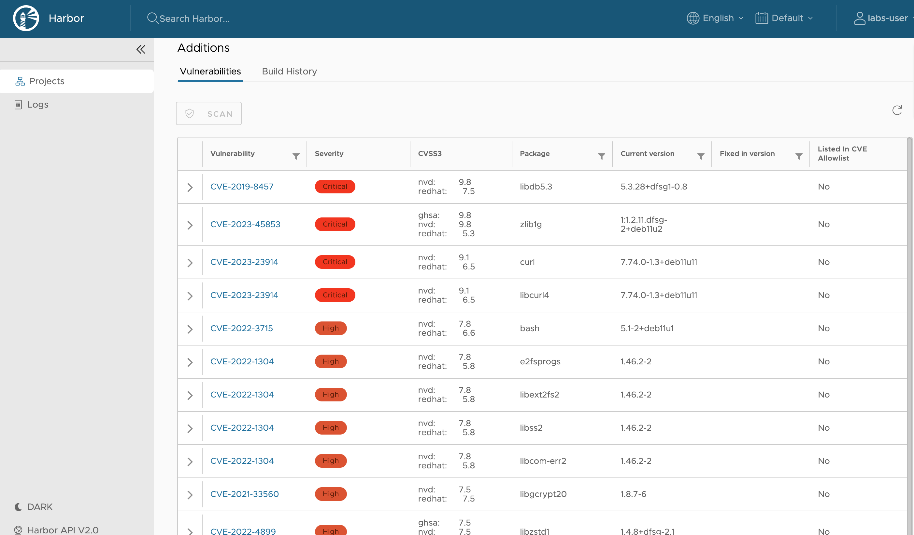

## Prerequisites

To automatically scan images for vulnerabilities, `Automatically scan images on push` in the Team project settings in Harbor needs to be enabled by the platform administrator:

## Scanning images

When your Team is using Harbor for private image registries, you can use Trivy to automatically scan your images on push. When `Automatically scan images on push` is enabled by the platform administrator, you can see the results of the scans by following these steps:

- In the apps section in APL console, click on Harbor.

- Click on your project. You will only see the projects of the Teams that you are a member of.

- You will now see a list of the teams repositories.

- Click on the repository that contains the artifact (image) that you would like to investigate.

- In the list of artifacts, you can see a summary of the scan results.

When you click on the scanned artifact, you'll see a more detailed report on all the vulnerabilities:

