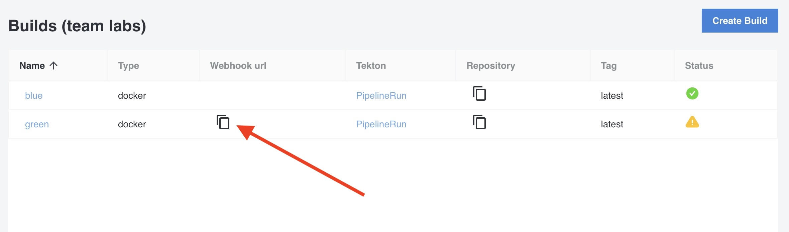
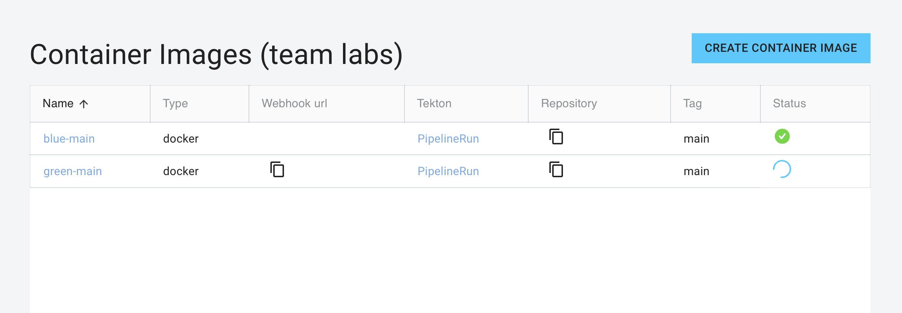

In the previous lab we created a Build using the `blue` repo in Gitea. In this lab we'll create a build for the `green` repo and trigger the build based on a webhook.

## Create a Build with Trigger enabled

1. In the left menu, click on `Builds`.

2. Click on `Create Build`.

3. Fill in the name `green` for your build.

4. Choose `Docker` and fill in the repo URL for the `green` repo created in the previous lab: `https://gitea.<your-domain>/<gitea-username>/green`.

5. Enable `Trigger`.

6. Click `Submit`.

## Get the webhook URL

Before we can configure the webhook for the `green` repo in Gitea, we will need the webhook URL. You can find this webhook URL for your build in the list of Builds. Add the webhook URL to your clipboard.

Also notice that the status of the Build shows an exclamation mark. This is because the Pipeline is created, but the PipelineRun is not yet created because it was not triggered yet.

## Create a Webhook

1. In the Console, click on `apps` the left menu and then open `Gitea`.

2. In the top left menu of Gitea, click on `Explore` and then on the `green` repo.

3. Go to `Settings` (top right) and then to `Webhooks`.

4. Click `Add Webhook` and select `Gitea`.

5. In the `Target URL`, paste the webhook URL from your clipboard.

6. Click `Add Webhook`.

## Trigger the build

You can now trigger the build by doing a commit in the `green` repo, or by testing the webhook. Let's test the webhook:

1. In Gitea, go to the `Settings` (top right) of the `green` repo and then to `Webhooks`.

2. Click on the webhook we just created.

3. In the bottom, click on `Test Delivery`.

## Check the status of the build

The build should now have started. Based on the webhook, Tekton has now created a `PipelineRun`. Let's check the status of the PipelineRun:

1. In the Console, click on `Builds`

Because the Build was triggered, a PipelineRun is now running and the status of the Build will show `in progress`:

When the Build is completed, the status will show `healthy`:

2. In the list of Builds, click on the `PipelineRun` link of the `green` build.

3. Tekton Dashboard will open and show a list of all the PipelineRuns. It will show all PipelineRuns because when using a Trigger, the PipelineRun resource is created based on a template and the Console will not know the exact name of the PipelineRun because the name is automatically generated.

4. Click on the PipelineRun with the name `docker-trigger-build-green-*`.

5. You can now see the the full log of the build.
