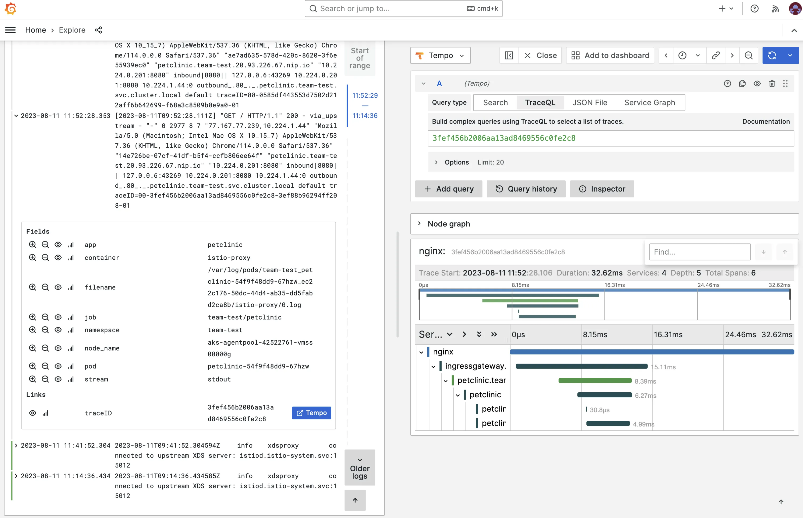
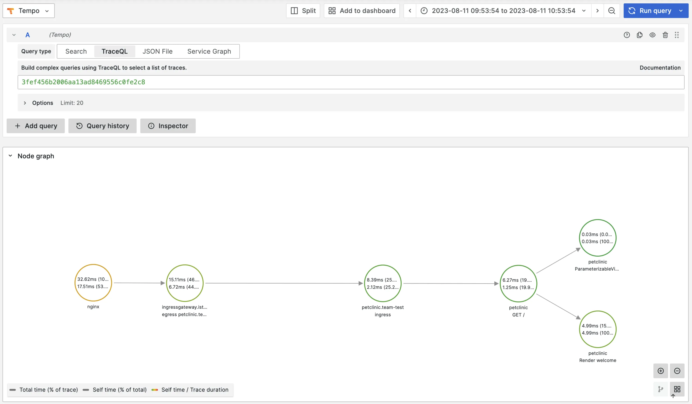

:::info
This lab requires a user with the `platform-administrator` role!
:::

In order to make a system observable, it must be instrumented. Language specific implementation of OpenTelemetry provides a way to instrument your application without touching your source code. In this lab we're going to instrument a Java application.

## Prerequisites

Make sure the following Apps are enabled on the platform (requires a user with the `platform-administrator` role):

- `Tempo` on Platform
- `Otel` on Platform
- `Loki` on Platform
- `Grafana` for the Team

Enable tracing for `Istio` and `ingress-nginx-platform`:

1. Go to `Apps`.

2. Click on `Istio`.

3. Click on the configuration icon.

4. Click on the `Values` tab.

5. In the values click `Edit` and set the following values:

```yaml
tracing:
  enabled: true
  samplingRatio: "100"
```

:::note
Setting the `samplingRatio` to `100` is only done for this lab to make sure all traces are sampled. In a production environment the ratio would normally be set to `0.01`.
:::

6. Click `Submit`.

7. Repeat step 2 to 6 for the `ingress-nginx-platform` app.

:::note
Sometimes instrumenting the nginx-ingress controller requires a restart of the pods. Restart the `ingress-nginx-platform-controller` Pod if you don't see any traces from nginx.
:::

## Build an image from source code

For this lab we're going to use the [Spring PetClinic Sample Application](https://github.com/spring-projects/spring-petclinic). Follow these steps to build an image from source code.

### Add the code repository

1. In the left menu in the Console, click on `Code Repositories`.

2. Click on `ADD CODE REPOSITORY`.

3. Provide a name for this code repository. The name will be used to identify the code repository in App Platform. You can only use the name once within a Team. We are going to use the name `petclinic` for this code repository.

4. Select `GitHub` for the Git service.

5. Fill in the following `Repository URL`: https://github.com/spring-projects/spring-petclinic.git

6. Click `Add Code repository`

### Create the container image

1. In the left menu of the Console, click on `Container Images`.

2. Click on `CREATE CONTAINER IMAGE`.

3. Select the `BuildPacks` build task.

4. Select the `petclinic` repository from the Repository drop-down list.

5. Select the Reference `main`.

6. Optionally you can change the Image name and tag. This is the name and tag used to store the image in the private Harbor image registry.

7. Under `Extra arguments`, click `Add argument`. Set `Name`: `BP_JVM_VERSION` and `Value`: `25`.

8. Click `Create Container Image`.

## Create a workload from the developer catalog

1. Go to Container Images in the left menu and click on the `Add to clipboard` of the `petclinc` image in the Repository column. Remember that the tag is main.

2. Go to `Workloads` in the left menu and click on `Create Workload`.

3. Select `k8s-deployment-otel` from the catalog.

4. Add the Name `petclinic` for the workload.

5. Leave the `Auto image updater` to `Disabled`.

6. In the workload `values`, change the following parameters:

```yaml
image:
  repository: <paste from clipboard>
  tag: main
```

Because we're deploying a Java application here, maybe also change the resources:

```yaml
resources:
  limits:
    cpu: 500m
    memory: 1Gi
  requests:
    cpu: 300m
    memory: 256Mi
```

6. Click `Submit`.

## Expose the service

1. In the left menu click `Services` then click on `CREATE SERVICE`.

2. Select the `petclinic` service from the `Service Name` drop-down list:

4. Click `Create Service`.

## See traces

To be able to see traces, we'll first need to generate some requests. Click on the URL of the `petclinic` service and generate some requests.

To see traces, you'll first need to find a `TraceID` of a trace. Go to `Apps` in the left menu and then click op `Loki`. Select the label `App` and select value `petclinic`.

Click on a log entry of a request. Note that the requests are logged by the Istio Envoy proxy. You will now see a link to the full trace in Grafana Tempo. Click on it.

:::note
If you don't see any traces, then check and see if the pod runs the `ghcr.io/open-telemetry/opentelemetry-operator/autoinstrumentation-java:1.26.0` container. Sometimes the pod starts before the `Instrumentation` resource has been created. If this is the case, restart the Pod.
:::



And when you click on the Node graph, you’ll see the complete flow:


