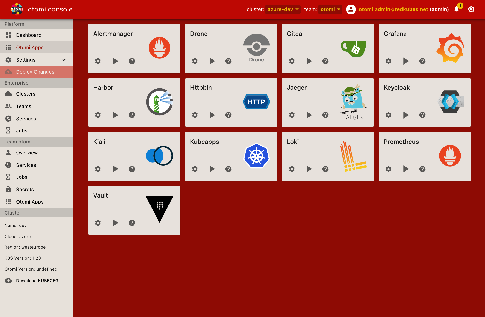

## Otomi Console

Otomi Console is the UI of Otomi and offers a desktop like experience for Kubernetes.

Otomi Console has a topbar showing a cluster and team selector on the top and the logged-in user. The team selector allows to switch to the context one wishes to operate for. Otomi Console also has a menu (on the left when in desktop mode). The menu shows the sections "Platform", "Enterprise", "Team `$name`" and "Cluster".

### Platform section

The "Platform" section gives access to:

- The dashboard which gives stats about clusters, teams and services
- The list of [platform applications](platform-apps) [ADMINS ONLY]
- The settings in use by the cluster [ADMINS ONLY]

### Enterprise section

The "Enterprise" section gives access to:

- The list of known Otomi [Clusters](clusters)
- The list of [Teams](teams) using this cluster
- The list of all [Services](services) running on this cluster
- The list of all [Jobs](jobs) running on this cluster

### Team section

The "Team `$name`" section gives access to:

- [Team](teams) configuration
- The list of [Services](services) managed by the team on this cluster
- The list of [Jobs](jobs) managed by the team on this cluster
- The list of [Secrets](secrets) managed by the team on this cluster
- The [Apps](team-apps) available to the team on this cluster

### Cluster section

The "Cluster" section shows:

- Cluster information such as name, cloud, region, k8s version, otomi version, etc
- A "Download KUBECFG" link to download a KUBECONFIG file that gives access to the namespace of the team selected. Admins can download one with `cluster-admin` permissions (giving access to all namespaces) by setting the team selector to '-'. You can use it like `KUBECONFIG=$file_location kubectl ...` or by merging it with another KUBECONFIG file like `.kube/config`. Please visit the official k8s [documentation about managing kube contexts](https://kubernetes.io/docs/concepts/configuration/organize-cluster-access-kubeconfig/).
