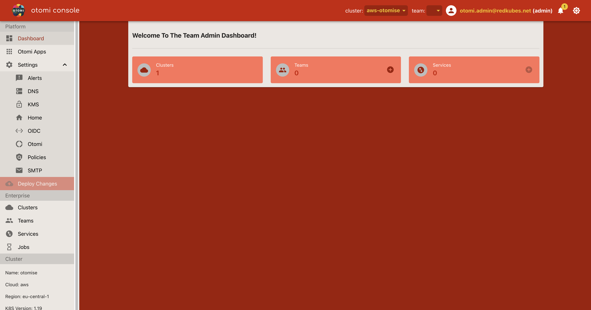
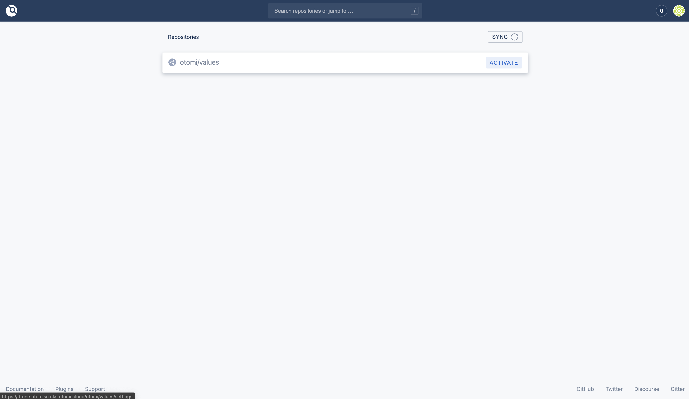
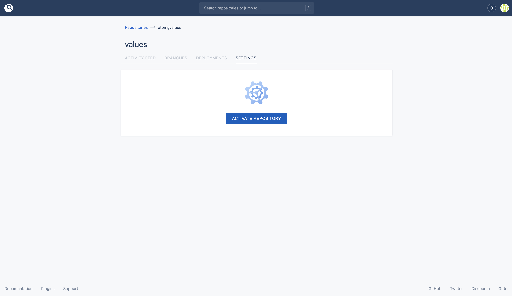
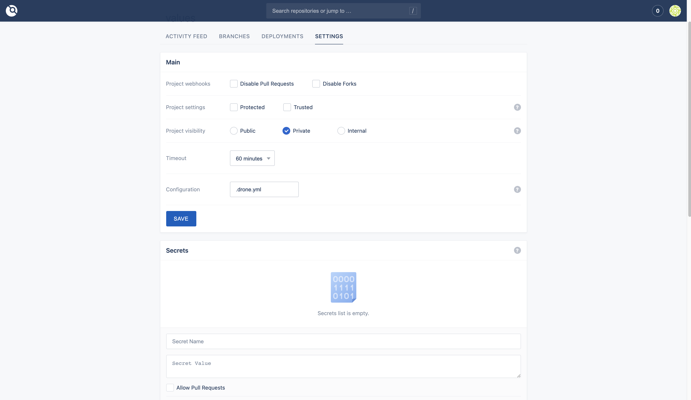
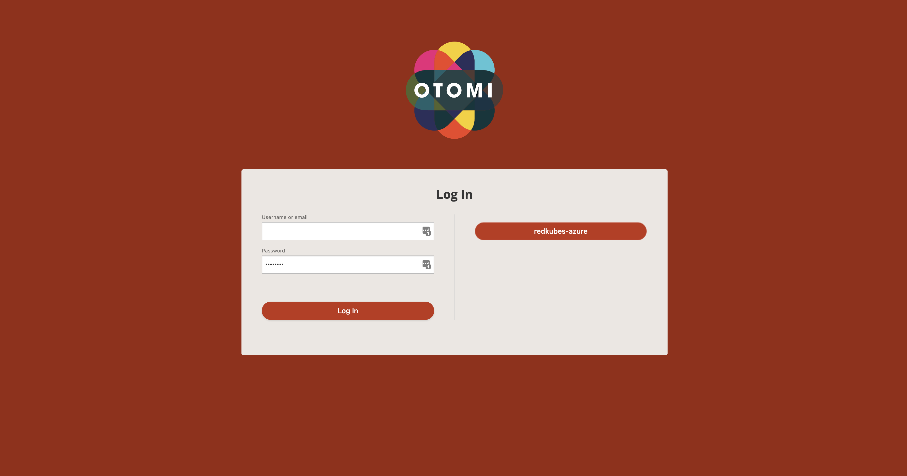

After Otomi is installed, a couple of post install configuration steps are required. Follow the instructions below:

## When Otomi is installed with minimal values

Follow these instructions when Otomi is installed without DNS (`otomi.hasExternalDNS=false`) and without a 3rd party IdP (`otomi.hasExternalIDP=false`).

### Get the log output of the installer job

When Otomi is installed with minimal values, passwords and public URLs (based on nip.io) are automatically generated and Keycloak is configured as an Identity Provider (IdP), in which one has to define Otomi users. The public URL of Otomi Console, the public URL of Keycloak and the admin credentials can be retrieved from the installer log. The installer job runs in the default namespace. In case the installer failed in the first run, the installer will automatically restart. Make sure to get the logs of the installer job with status `Completed`.


### Create a user in Keycloak

1. Navigate to Keycloak app (using the URL provided in the installer log)
2. Click on "Administration Console"
3. Login with admin credentials (using admin and password provided in the installer log)
4. Select the "Otomi" realm
5. Click on "Users" then "Add user"
6. Fill in a user name in the "Username" field
7. Fill in your email address in the "Email" field
8. Select the "otomi-admin" group
9. Click on "Save"
10. Choose the "Credentials" tab and then fill in a password for this user
11. Click on "Set Password"

:::info
When a password for the Keycloak admin is not provided in the values.yaml (but automatically generated), it is advised to first change the password.
:::

### Sign in to the console

Open the Otomi console (using the URL provided in the installer logs), and sign in with the new user.

After you have successfully logged in, you will see the Otomi Admin Dashboard. Click [here](/docs/console) to learn more about using Otomi Console.



### Add the auto generated CA to your keychain

1. In the left pane of the console, click on "Download CA"
2. Add the CA to your keychain:

```
sudo security add-trusted-cert -d -r trustRoot -k /Library/Keychains/System.keychain ~/Downloads/ca.crt
```

:::Note
To be able to log in to Harbor, restart the Docker service after adding the CA to your keychain. To be able to pull images from Harbor, add the CA to all cluster nodes.
:::

### Activate Drone

[Drone](https://www.drone.io/) is an integral part of how Otomi cluster configuration is stored and updated.

1. Click on the **Drone** app (under Platform/Otomi Apps) in the console.

:::info
When you see this message: 'Jwks doesn't have key to match kid or alg from Jwt' Drone is not yet ready. Please wait for a couple of minutes and try again.
:::

2. Sign in

Gitea provides an oauth2 app connection for Drone to work with it's git values. It will popup when drone is accessed the first time. You can sign in with "OpenID Connect", which registers the login as a new user, or with the Gitea admin credentials (username: "otomi-admin", password: `$otomi.adminPassword`). A job runs every 3 minutes promoting users with "admin" role to become co-owner of the otomi-values repo. When logging in with the admin user no waiting is necessary.

:::info
It can take a couple of minutes before you will see the repository. Otomi first needs to add your user to Gitea. 
:::

3. Use the pre-filled values for the `Username` and `Email Address` and click `Complete Account`
4. Select `Activate`



5. Click on `ACTIVATE REPOSITORY`



6. Save the changes and you are good to go.



Now the final step is to create a team. See the [Teams](/docs/console/teams) page for more information.

## When Otomi is installed with optional configuration

### Sign in to the console

If Otomi is configured with `hasExternalIDP=true` and `oidc` settings have been provided for an external IDP, click on the right button ("redkubes-azure" in the example below).



When OIDC is configured, an external IDP user needs to be a member of the "otomi-admin" group. Now follow the same steps as described above to activate Drone.
