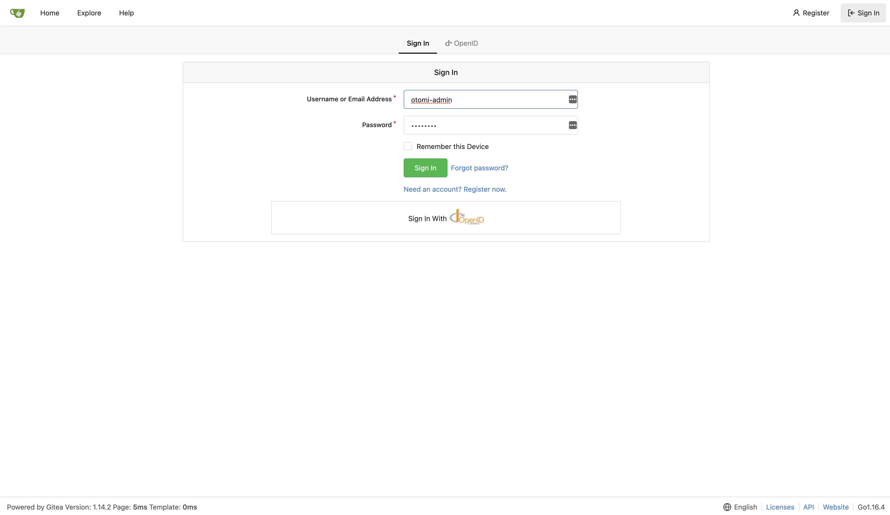
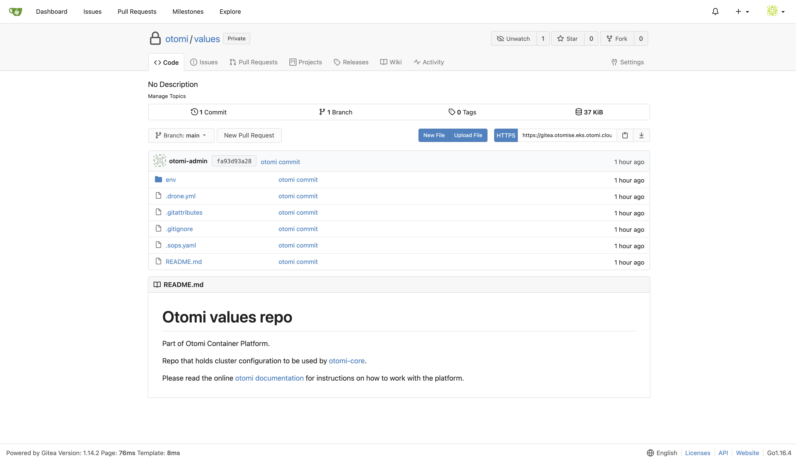

After installing Otomi, a couple of post install configuration actions are required. Follow these instructions:

### Sign in to the Otomi Console

Open the url in the browser of your choice `https://otomi.<domainSuffix>`. The `domainSuffix` can be found in the `values.yaml` that was provided during installation.

If Otomi is configured with OIDC (using Azure AD as an IDP), click on the right button (redkubes-azure in the example below). If you did not configure OIDC, then first [create an account in Keycloak](/docs/apps/keycloak#create-users). and add this account to the `otomi-admin` group.

After you have successfully logged in, you will see the **Otomi Dashboard.**. To learn more about using Otomi Console, checkout [Otomi Console](/docs/console)

### Activate Drone

[Gitea](https://gitea.io/en-us/) and [Drone](https://www.drone.io/) are an integral part of how Otomi cluster configurations are stored and updated. Click on the **Gitea** app (under Platform/Otomi Apps) in the console. It will open a new browser tab and show the sign in page of Gitea. Sign in into with the default `otomi-admin` account.

After sign in, it can take a couple of minutes before the `otomi/values` repository becomes visible.

The `otomi/values` repository holds the otomi cluster configuration and is updated whenever new changes occur through the console. Now head back to the console to activate Drone.

Click on the Drone app and it should open a new tab as shown below,

Select `Activate`, and then `ACTIVATE REPOSITORY`

Save the changes and you are good to go.

Now the final step is to create a Team. See the **[Teams](/docs/console/teams)** page for more information.
