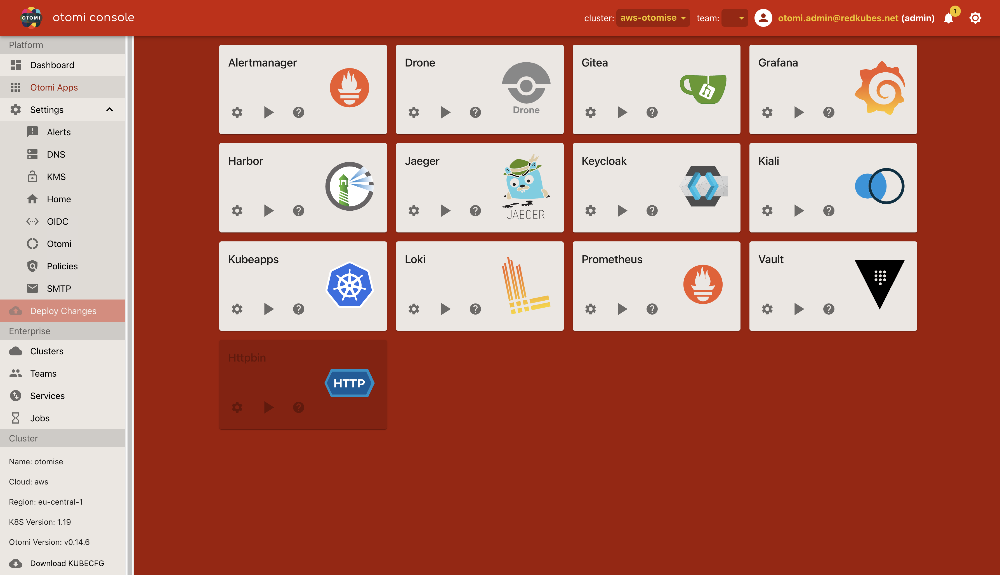

After Otomi is installed, a couple of post install configuration steps are required. Follow the instructions below:

## When Otomi is installed without optional configuration

Follow these instructions when Otomi is installed without DNS and without bringing your own IDP (like Azure AD):

### Get the log output of the installer job

When Otomi is installed without optional configuration, first get the Keycloak URL and the auto generated password for the Keycloak `admin` user provided at the end of the logs of the Otomi installer job:

```bash
kubectl logs jobs/otomi -n default
```

### Create a user in Keycloak

1. Go to Keycloak admin console using the following url: `keycloak.<your domainSuffix>`
2. Click on `Administration Console`
3. Login with username: `admin` and the password `<otomi.adminPassword>` provided in your values.
4. Select the `Otomi` realm
5. Click on `Users` then `Add user` 
6. Fill in a user name in the Username field
7. Fill in your email address in the Email field
8. Select the `otomi-admin` group
9. Click on `Save`
10. Click on the `Credentials` tab and then fill in a password for this user in the `Password` and `Password Confirmation` fields
11. Click on `Set Password`

:::info
When a password for the Keycloak admin is not provided in the values.yaml (but automatically generated), it is advised to first change the password the password.
:::

### Sign in to the console

Open the Otomi console (using the URL provided in the installer logs), and sign in with the new user.

After you have successfully logged in, you will see the Otomi Admin Dashboard. Click [here](/docs/console) to learn more about using Otomi Console.





### Add the auto generated CA to your keychain (optional)

When Otomi is installed without DNS and with an auto generated CA, add the CA to you keychain:

1. In the left pane of the console, click on `download CA`
2. Add the CA to your keychain:

```
sudo security add-trusted-cert -d -r trustRoot -k /Library/Keychains/System.keychain ~/Downloads/ca.crt
```

### Activate Drone

[Gitea](https://gitea.io/en-us/) and [Drone](https://www.drone.io/) are an integral part of how Otomi cluster configurations are stored and updated. 

1. Click on the **Gitea** app (under Platform/Otomi Apps) in the console. 
2. In the top right, click on `Sign In`
3. Sign in using `OpenID`
4. Use the pre-filled values for the `Username` and `Email Address` and click `Complete Account`

It could take a couple of minutes before the values repository becomes visible. The `otomi/values` repository holds the otomi cluster configuration and is updated whenever new changes occur through the console.


Now head back to the console to activate Drone.

1. Click on the Drone app and it should open a new tab as shown below


2. Select `Activate`, and then `ACTIVATE REPOSITORY`


3. Save the changes and you are good to go.


Now the final step is to create a Team. See the **[Teams](/docs/console/teams)** page for more information.

## When Otomi is installed with optional configuration

### Sign in to the console

If Otomi is configured with OIDC (using Azure AD as an IDP), click on the right button (redkubes-azure in the example below). 


When OIDC is configured, an Active Directory user needs to be a member of the otomi-admin group. Now follow the same steps as described above to activate Drone.
