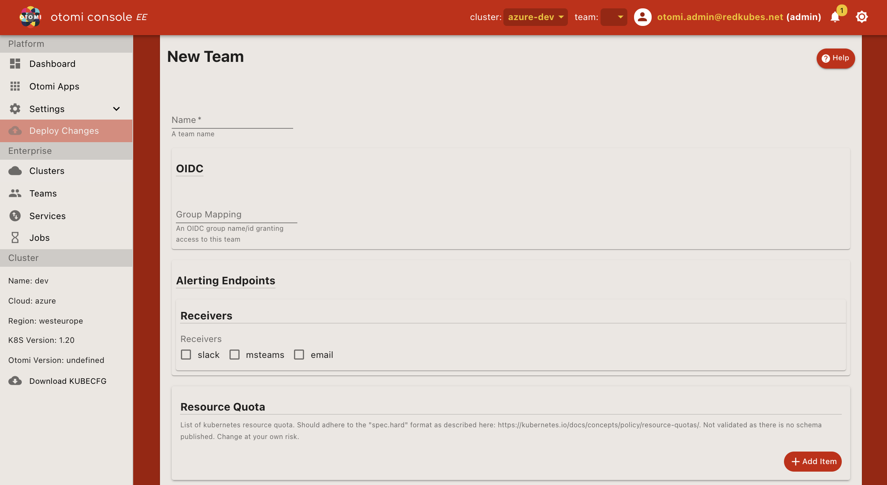

Teams are tenants on the platform to support Development/DevOps teams, projects or even DTAP. A team will get access to Otomi Console, providing access to all the tools needed for complete observability. Teams can choose to receive alerts in Microsoft Teams, Slack or email and each team will get access to a project in Harbor and a space in Vault.

## Creating Teams

1. Login with a user who is a member of the otomi-admin or team-admin role.
2. Provide a name for the team (lowercase). The teamname can not be changed afterwards! Creating a team will result in the creation of namespace `team-$NAME`.
3. Provide a OIDC group name/id granting for granting access to team. Only members of the group will get access to the team.
4. In order to receive alerts, please choose an alerting endpoint:

:::note Notes

When a field is left empty it will default to the global admin value for that field, if that exists.

:::

| Option          | Description                                                                      |
| --------------- | -------------------------------------------------------------------------------- |
| Slack           | Needs a slack webhook url that will give alerts for warnings and criticals       |
| Microsoft Teams | Needs two alerting endpoints, for both warnings as well as criticals             |
| Email           | You may provide a list of email addresses for both 'Non Critical' and 'Critical' |
| None            | Global (admin) alerting endpoint configuration will be used                      |

5. Add Resource Quotas

When required, add resource quota for the team. The resource quota should adhere to the "spec.hard" format as described [here](https://kubernetes.io/docs/concepts/policy/resource-quotas/).

:::note Notes

There is no validation as there is no schema published. Add/change resource quota at your own risk.

:::

6. Configure Azure Monitor (on Azure only).

Azure Monitor is the platform service that provides a single source for monitoring Azure resources.

| Option                                | Description                   |
| ------------------------------------- | ----------------------------- |
| No Azure monitoring                   | -                             |
| Azure monitoring with global settings | Takes on the global settings  |
| Azure monitoring with custom settings | Overrides any global settings |

7. Add Team self service flags.

A uses with the `otomi-admin` and `team-admin` role can create teams and grant the team permissions to modify certain configuration parameters.

| Option               | Description                                                                             |
| -------------------- | --------------------------------------------------------------------------------------- |
| Ingress              | Select to grant the team the permission to configure exposure for [services](services). |
| Team / Alerts        | Select to grant the team the permission to configure Alerts for the team.               |
| Team / OIDC          | Select to grant the team the permission to configure OIDC for the team.                 |
| Team / resourceQuota | Select to grant the team the permission to configure Resource Quota for the team.       |
