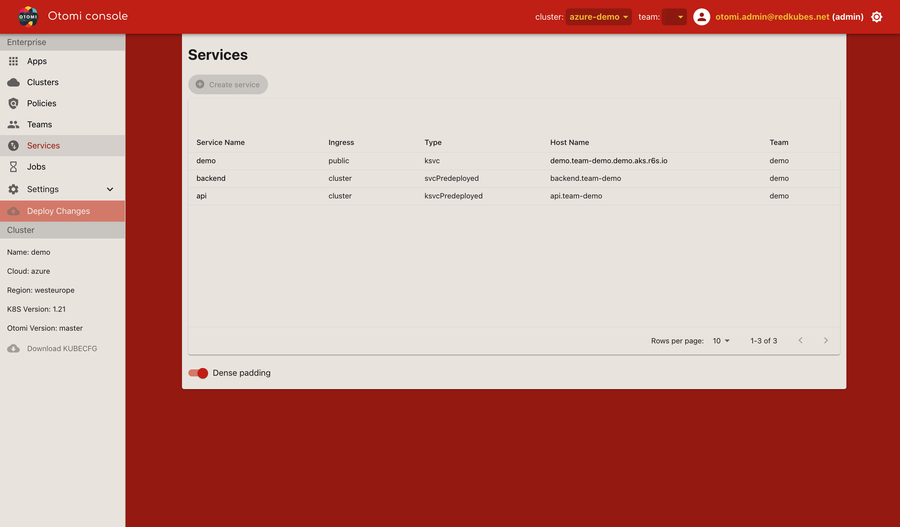

All known Services on the platform are listed here. Services can be sorted based on:

| Property     | Description                                            |
| ------------ | ------------------------------------------------------ |
| Service Name | The name of the service                                |
| Ingress      | Configures ingress type (public/cluster)               |
| Type         | The service type (svcPredeployed/ksvcPredeployed/ksvc) |
| Team         | The team that owns the service                         |

The `Create service` button will only become active when a team is selected.
