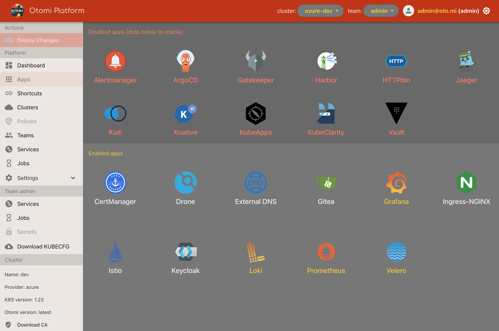

## App section

The apps section lists all apps available to the otomi-admin role. The apps section is devided into 2 parts:

### Disabled apps

The disabled apps are available for users to activate. Drag and drop the app to the enabled section to activate the app. This will install the app based on the Otomi default configuration.

### Enabled apps

After installing Otomi, only the Core apps will be active and visable in the enabled apps section. Core apps have white names.

## App configuration

The Otomi default app configuration (values) can be modified for your desired use case. When you click on the app. you'll see a menu bar in the top with the following options:

### Info

Here you will find more information about the app and how the app is integrated into Otomi.

### Shortcuts

Create shortcuts to open the app at a target path. Created shortcuts will also become visable in the [Shortcuts](shortcuts) section

### Values

Here you will see the Otomi default (chart) values for the app as specified in the Otomi values [schema](https://github.com/redkubes/otomi-core/blob/main/values-schema.yaml). Click on a value to see the defaults. You can change the defaults to customize the configuration.

### Raw values

In the Raw values, all values of the app chart that are not part of the Otomi values schema can be specified.

### Open the app

When the apps has a UI, click on the `play` icon in the right of the app bar.
