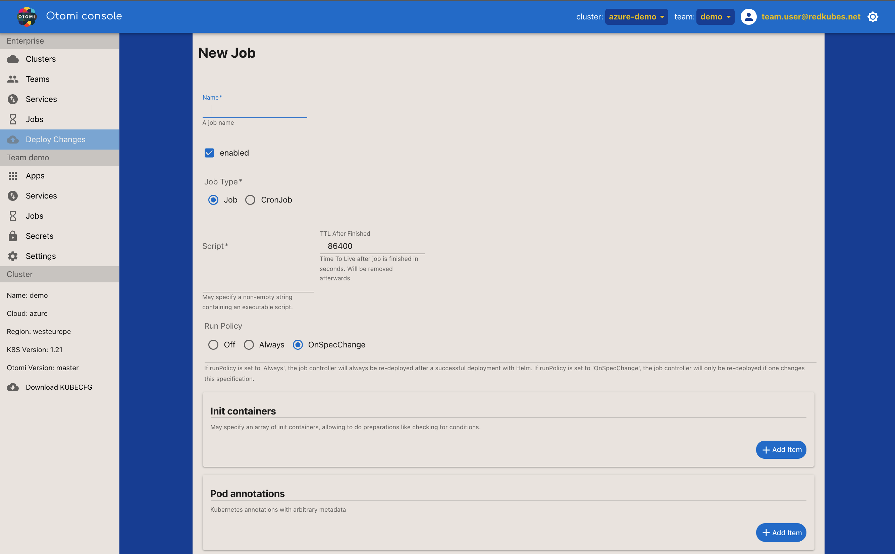

This page describes how to create a job, and how to edit a job. Both creating and editing a job use the same form. A Job creates one or more Pods and will continue to retry execution of the Pods until a specified number of them successfully terminate. Otomi also supports creating CronJobs. CronJobs are useful for creating periodic and recurring tasks, like running backups or sending emails. CronJobs can also schedule individual tasks for a specific time, such as scheduling a Job for when your cluster is likely to be idle.

## Type

The type of the job. 2 job types are supported:

| Type     | Description                                    |
| -------- | ---------------------------------------------- |
| Job      | A Jon creates a Kubernetes Job                 |
| Cron Job | A CronJob creates Jobs on a repeating schedule |

## Name

Name of the Job.

## Enabled

Select to enable the Job. If not enabled, the Job will nopt be executed.

## RunPolicy

| Setting      | Description                                                                    |
| ------------ | ------------------------------------------------------------------------------ |
| Always       | The job controller will always be re-deployed after a successful deployment    |
| OnSpecChange | The job controller will only be re-deployed if one changes this specification. |

## Script

The script to be executed. May specify a non-empty string containing an executable script.

## TTL After Finished

Time To Live after the job is finished in seconds. Will be removed afterwards.

## Init Container

Can be used to specify an init container, allowing to do preparations like checking for conditions.

### Container Image

| Setting    | Description                                                 |
| ---------- | ----------------------------------------------------------- |
| Repository | The full repository url of the image (i.e. `otomi/console`) |
| Tag        | The image tag (i.e. `latest`)                               |
| PullPolicy | The selected pullpolicy (i.e. `IfNotPresent` or `Always`)   |

### Container resources

Please refer to [the kubernetes documentation](https://kubernetes.io/docs/concepts/configuration/manage-resources-containers/) for in depth information on how to determine the values your workload needs.

##### Requests

| Setting | Description                  |
| ------- | ---------------------------- |
| cpu     | The guaranteed amount of CPU |
| memory  | the guaranteed amount of RAM |

##### Limits

| Setting | Description               |
| ------- | ------------------------- |
| cpu     | The maximum amount of CPU |
| memory  | the maximum amount of RAM |

NOTE: Limits are not guaranteed. If you need guaranteed resources, set higher [requests](#requests).

### Environment variables

Provide all the needed environment variables that are needed for your container to run.

### Secrets

Secrets that have been created with the console can be referenced here by name. All props from the secret will be injected as env var.

### Secret mounts

Secrets that have been created with the console can be mounted on a path. All props from the secret will be added as file on the path.

### Files

Files registered here as path > content pairs will be mounted in the container.

### Command

Override the entrypoint/command of the container.

### Command Arguments

Override the arguments given to the entrypoint/command of the container.

## Pod annotations

Kubernetes annotations with arbitrary metadata.

## Container image

| Setting    | Description                                                 |
| ---------- | ----------------------------------------------------------- |
| Repository | The full repository url of the image (i.e. `otomi/console`) |
| Tag        | The image tag (i.e. `latest`)                               |
| PullPolicy | The selected pullpolicy (i.e. `IfNotPresent` or `Always`)   |

## Container resources

Please refer to [the kubernetes documentation](https://kubernetes.io/docs/concepts/configuration/manage-resources-containers/) for in depth information on how to determine the values your workload needs.

### Requests

| Setting | Description                  |
| ------- | ---------------------------- |
| cpu     | The guaranteed amount of CPU |
| memory  | the guaranteed amount of RAM |

### Limits

| Setting | Description               |
| ------- | ------------------------- |
| cpu     | The maximum amount of CPU |
| memory  | the maximum amount of RAM |

NOTE: Limits are not guaranteed. If you need guaranteed resources, set higher requests.

### Environment variables

Provide all the needed environment variables that are needed for your container to run.

### Secrets

Secrets that have been created with the console can be referenced here by name. All props from the secret will be injected as env var.

### Secret mounts

Secrets that have been created with the console can be mounted on a path. All props from the secret will be added as file on the path.

### Files

Files registered here as path > content pairs will be mounted in the container.

### Command

Override the entrypoint/command of the container.

### Command Arguments

Override the arguments given to the entrypoint/command of the container.
