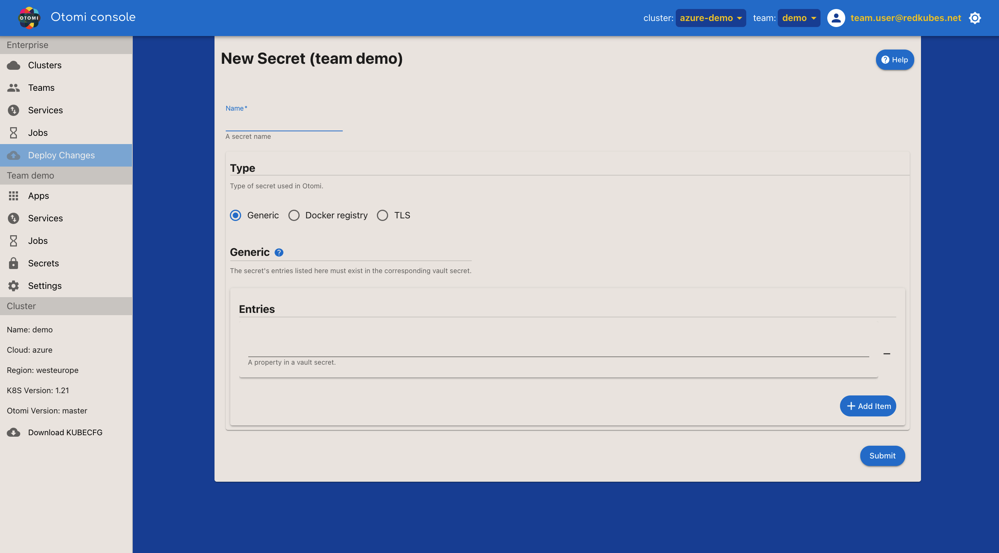

<!--  -->

Any secret that is created here should have it's counterpart in Vault by the same name. Otomi will create kubernetes secrets from those Vault secrets. These can then be used in Otomi Services and Otomi Jobs, as injected env vars, or as file mounts.

Otomi supports 3 types of secrets:

- [Create a Generic secret](#create-a-generic-secret)
- [Create a Docker Registry secret](#create-a-docker-registry-secret)
- [Create a TLS secret](#create-a-tls-secret)

### Create a Generic secret

Create a generic kubernetes secret by listing a selection of (or all) properties of a Vault secret registered with the same name.

### Create a Docker Registry secret

The docker registry (or pull) secret should exist in Vault as a secret with the same name. The vault secret should be of type "json" and have only one property `.dockerconfigjson`. Use the following command to create the json:

```bash
email="not@us.ed" # can be something else if the registry provider expects it, but usually this is ignored
server="" # example: "https://harbor.demo.eks.otomi.cloud/"
username="" # your username
password="" # your password, can be token
kubectl create secret docker-registry --dry-run=client regcred --docker-email=$email --docker-server=$server --docker-username=$username --docker-password=$password -o jsonpath='{.data.\.dockerconfigjson}' | base64 --decode
```

### Create a TLS secret

To create a TLS secret, the fields should correspond with the properties as named in the Vault secret registered with the same name. The "ca" field is optional and can be used to provide the certificate authority (for mTLS).

| Setting | Description                                                                   | Default |
| ------- | ----------------------------------------------------------------------------- | ------- |
| crt     | The property name pointing to the PEM encoded public key certificate in Vault | tls.crt |
| key     | The property name pointing to the private key certificate content in Vault    | tls.key |
| ca      | The property name pointing to the CA certificate content in Vault (optional)  | ca.crt  |
