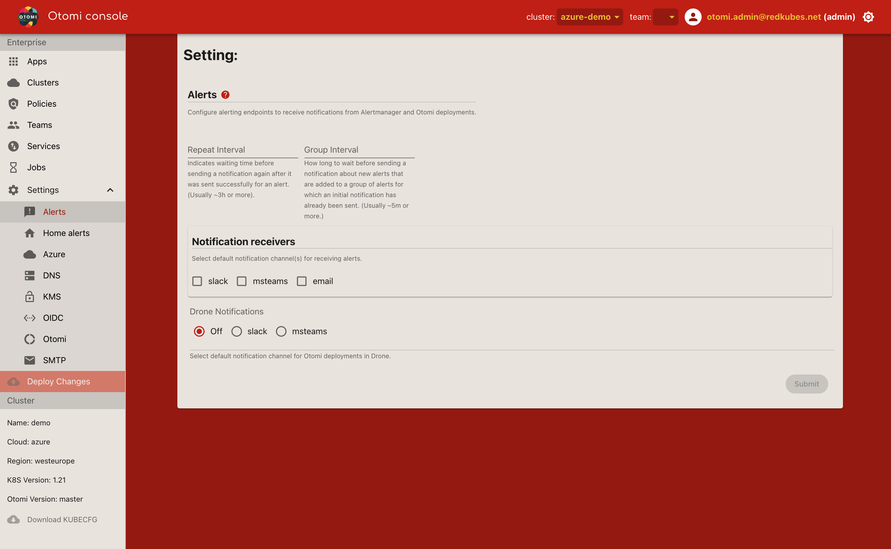
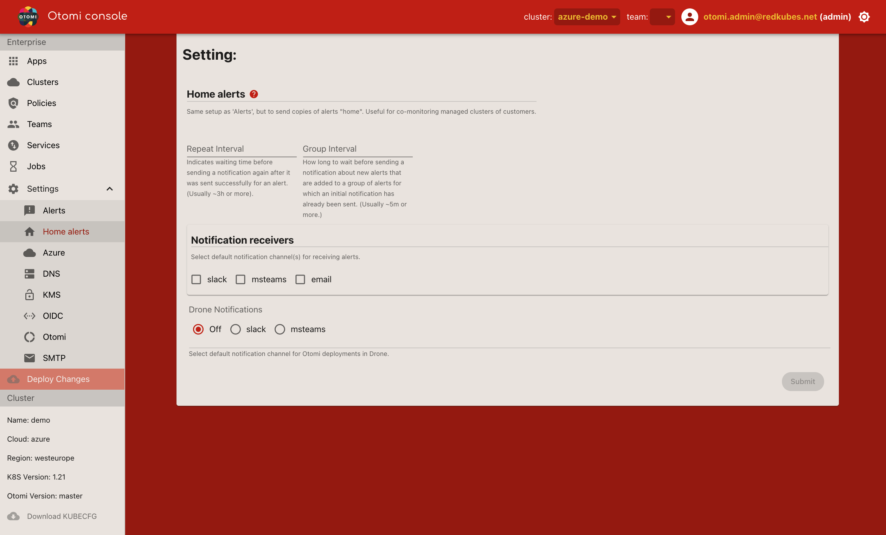
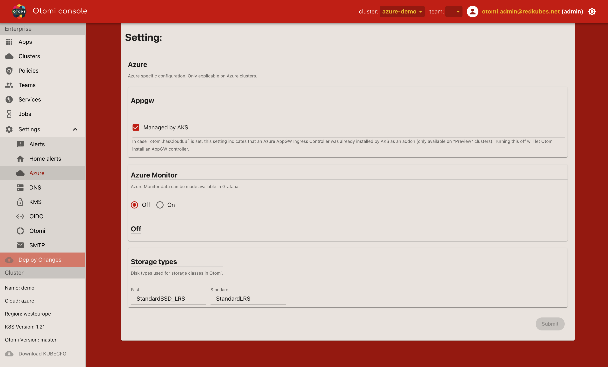
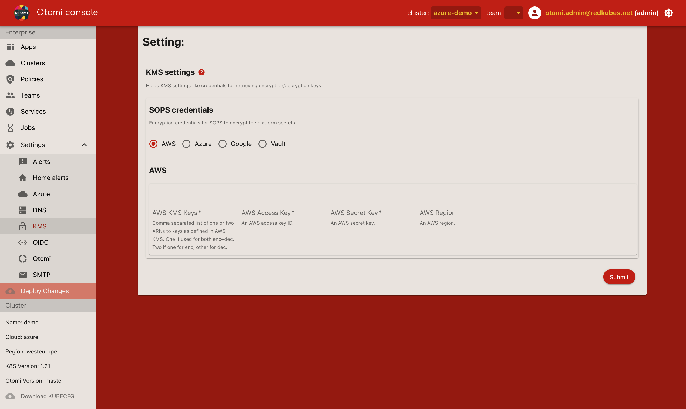
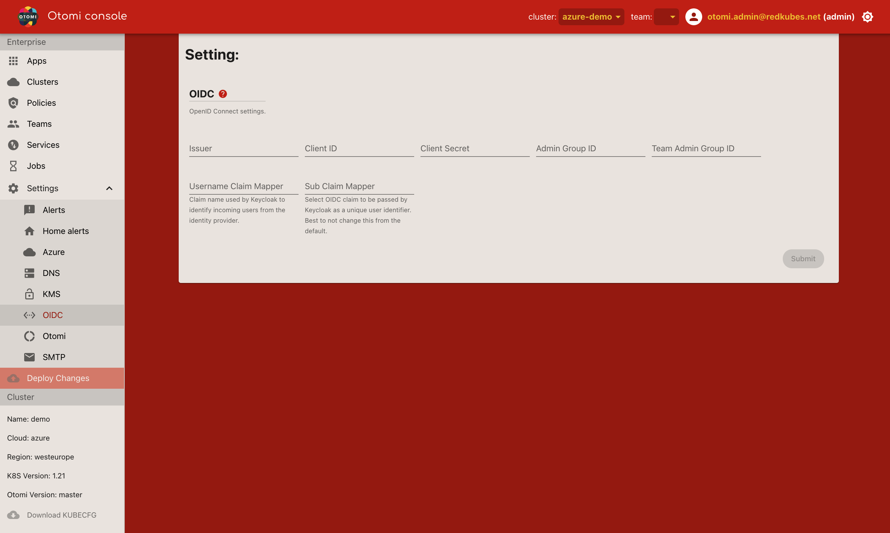
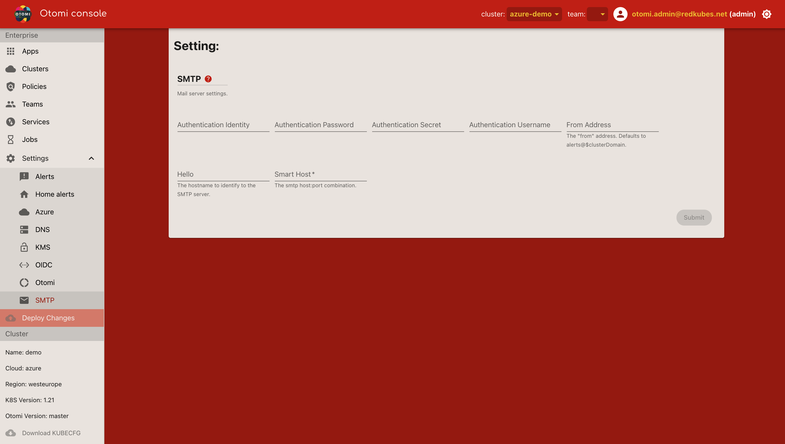

## Alerts

The alerts settings section offers configuration options to define alerting endpoints for alert manager and deployment feedback. The list of providers selected in `Notification receivers` should reflect their configuration. I.e. when receiver "slack" is selected, the slack configuration needs to be defined. Teams can also configure additional endpoints for the alerts spawning from their team namespace.

| Setting                | Description                                                                                                                                                                         |
| ---------------------- | ----------------------------------------------------------------------------------------------------------------------------------------------------------------------------------- |
| Repeat interval        | Indicates waiting time before sending a notification again after it was sent successfully for an alert. (Usually ~3h or more).                                                      |
| Group interval         | How long to wait before sending a notification about new alerts that are added to a group of alerts for which an initial notification has already been sent. (Usually ~5m or more.) |
| Slack                  | Slack webhook url and channels for critical and non-critical alerts.                                                                                                                |
| MSteams                | Microsoft Teams webhook urls for critical (high prio) and non-critical alerts (low prio).                                                                                           |
| Email                  | Email address(es) for critical and non-critical alerts.                                                                                                                             |
| Notification receivers | Select default notification channel(s) for receiving alerts.                                                                                                                        |
| Drone notifications    | Channel to be used by the deployment pipeline for failure/success notifications. Can only be delivered to Slack or MSteams (for now).                                               |

## Home alerts

The Home alerts section is similar to the [Alerts](alerts) section, but with a different intent: the configuration here is meant to target "Home" alerting endpoints. Those will become active when `otomi.isHomeMonitored` is turned on. This allows for a 3rd party to also monitor the system. This comes in handy when setting up Otomi as a managed service for clients that want to receive notifications themselves. We consider "Home" to be the managing party, and the regular "Alerts" section should then only contain endpoints for the client. Of course teams can still configure their own endpoints for the alerts spawning from their team namespace.

## Azure

The Azure settings section offers specific configuration options when running Otomi on a Kubernetes cluster in Azure. Note that this section will only be available when running on Azure (cloud=azure).

| Setting       | Description                                                               |
| ------------- | ------------------------------------------------------------------------- |
| Appgw         | Select if Azure Application Gateway is used as an external Load Balancer. |
| Azure Monitor | Turn on Azure monitor to use Azure metrics in Grafana dashboards.         |
| Storage Types | Specify the Azure disk types used for storage classes in Otomi.           |

IMPORTANT NOTES:

Using an Azure Application Gateway is optional. In case an application gateway is used with a WAF, make sure that its on detection mode and not prevention, as this might deny traffic to your cluster, which can have consequences on the availability of services. For example Grafana relies heavily on queries inside the api request that might trigger OWASP rules.

## DNS

The DNS settings section offers configuration options for DNS.

| Setting  | Description                                                                                     |
| -------- | ----------------------------------------------------------------------------------------------- |
| Zones    | Defines the dns zones accessible by the credentials given in the "Provider" section underneath. |
| Provider | The provider hosting the dns zones. Can be AWS, Azure or Google.                                |

## KMS

The KMS settings section offers configuration options for the Key Management Service information needed to seal and unseal secrets used by Otomi. Otomi needs at least one key. It needs one for encrypting/decrypting the `otomi-values` repo), and one for sealing/unsealing Vault storage.

IMPORTANT NOTES:

- When omitting KMS credentials for SOPS, the secrets in the otomi-values repo will be stored in plain text
- When omitting KMS credentials for Vault, on startup it will generate its own k8s secret for sealing/unsealing, so be careful not to remove it!

It is advised to provide credentials to an external stable KMS (such as from the cloud the cluster was deployed in), so that unseal keys can always be managed from one central location. The same credentials can be used for both SOPS and Vault, but that is up to you to decide.

Settings for Vault can be found under `apps.vault` in the Otomi values repository, but will be added to this section soon.

## OIDC

The OIDC settings section offers configuration options to connect with an external Identity Provider (Bring Your Own IDP). This allows to map IDP group names to the following Otomi roles:

- Otomi admins (`adminGroupID`)
- Team admins (`teamAdminGroupID`)

Some settings are left in case Keycloak is not needed (it is heavy, and small teams might not need authorization), and are used by Grafana only:

- Auth url
- Api url
- Token url

## Otomi

The Otomi settings section offers configuration options for Otomi and feature flags that influence the way Otomi behaves.

| Setting                | Description                                                                                                                                                                                                                                                                                                                          |
| ---------------------- | ------------------------------------------------------------------------------------------------------------------------------------------------------------------------------------------------------------------------------------------------------------------------------------------------------------------------------------ |
| Admin password         | Default admin password for all Otomi apps. Handy for quick rotation ;)                                                                                                                                                                                                                                                               |
| Additional Clusters    | A list of additional clusters to select in the Otomi console.                                                                                                                                                                                                                                                                        |
| External load balancer | Set this to true when an external load balancer exists (Azure AppGW, Google Apigee) or needs to be started (AWS ALB). This will then be configured through ingress controllers. Expects existing LBs to terminate https. Currently this is only working correctly for Azure, and not for AWS and Google. AWS is close to completion. |
| Home monitored         | When this is turned on alerts will also be sent to the endpoints configured in the "Home" settings.                                                                                                                                                                                                                                  |
| Managed masters        | Whether masters are managed and not under control. Set this to false when onprem.                                                                                                                                                                                                                                                    |
| Multi-tenancy          | Will separate team metrics and logs. Disabling this lets everybody be admin and see everything. Will still use team-\* namespaces for segmentation of services, but not use authorization of users.                                                                                                                                  |

## SMTP

The alerts settings section offers configuration options to define for Mail server settings. A mail server needs to be configured in case email notifications are used.
