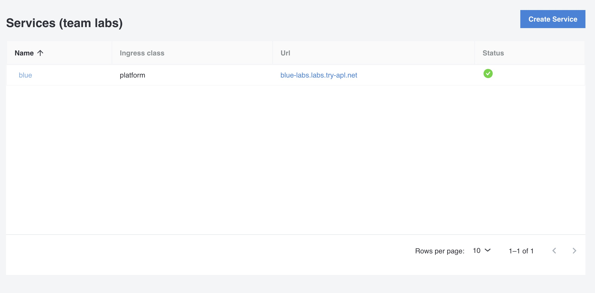

<!--  -->

A service in Otomi is a self-service feature for:

- Exposing pre-deployed K8s (clusterIP) and Knative services with a public URL. Otomi will automatically create and configure all ingress resources needed, including Istio Virtual Services and Gateways, certificates, DNS records and Oauth2 proxy for Single Sign On
- Configure ingress and ingress network policies for pre-deployed K8s and Knative services
- Easy creation of new Knative services

## Create a Service

1. Enter a name for the service. The name will be used to generate hostname if `Use suggested domain` is chosen (see below). When configuring ingress for an existing (pre-deployed) service, make sure the name provided here matches the name of the Knative or Kubernetes service (default).
2. Enter the port number of the service.

After providing a name and a port number, you can now configure ingress for the existing Kubernetes service and optionally select a different service type.

If the defaults (cluster/private) apply, you can now click 'Submit'.

## Configuring the Service Type

The Service type is the type of service to deploy/expose. 

Three options are supported:

- [1. Existing Kubernetes Service](#existing-kubernetes-service)
- [2. Existing Knative service](#existing-knative-service)
- [3. New Knative Service](#new-knative-service)

### Existing Kubernetes Service

When selecting this option, Otomi expects a pre-deployed Kubernetes service by the [name](#name) and [port](#port) given.

### Existing Knative Service

:::note

The Using existing Knative services option will only be available when Knative is active.
:::

When selecting this option, Otomi expects a pre-deployed Knative service by the [name](#name) and [port](#port) given. This option will do an internal rewrite of the public url to the existing knative url.

### New Knative service

:::note

The Creating a new Knative service option will only be available when Knative is active.
:::

Select this option to deploy a new knative service using Otomi. In this case, Otomi will generate a knative service manifest and deploy it for you.

#### Pod annotations

Kubernetes annotations with arbitrary metadata.

#### Container image

| Setting    | Description                                                 |
| ---------- | ----------------------------------------------------------- |
| Repository | The full repository url of the image (i.e. `otomi/console`) |
| Tag        | The image tag (i.e. `latest`)                               |
| PullPolicy | The selected pullpolicy (i.e. `IfNotPresent` or `Always`)   |

#### Container resources

Please refer to [the kubernetes documentation](https://kubernetes.io/docs/concepts/configuration/manage-resources-containers/) for in depth information on how to determine the values your workload needs.

##### Requests

| Setting | Description                  |
| ------- | ---------------------------- |
| cpu     | The guaranteed amount of CPU |
| memory  | the guaranteed amount of RAM |

##### Limits

| Setting | Description               |
| ------- | ------------------------- |
| cpu     | The maximum amount of CPU |
| memory  | the maximum amount of RAM |

NOTE: Limits are not guaranteed. If you need guaranteed resources, set higher [requests](#requests).

#### Environment variables

Provide all the needed environment variables that are needed for your container to run.

#### Secrets

Secrets that have been created with the console can be referenced here by name. All props from the secret will be injected as env var.

#### Secret mounts

Secrets that have been created with the console can be mounted on a path. All props from the secret will be added as file on the path.

#### Files

Files registered here as path > content pairs will be mounted in the container.

#### Command

Override the entrypoint/command of the container.

#### Command Arguments

Override the arguments given to the entrypoint/command of the container.

#### Container Port

Container port the knative pod will connect with. Leaving this empty will let knative infer the port from the container, which usually works, but might be problematic when the container does not specifically expose a port (As is the case with nginx derived images!). Default is set to 80.

#### Scale to zero

Will bring down service if not accessed for 60 seconds. Will also disable probes that check to see if the service is up.

## Configuring exposure (ingress)

Exposure controls wether internet exposure should be enabled or not. Three options exist:

- `Cluster`: has no internet exposure, and is only accessible in the cluster
- `Private`: only accessible via the cluster's private network loadbalancer (comming soon)
- `Public`: publicly accessible via the cluster's public network loadbalancer

### Cluster

If backend is a Knative service, this will expose a Knative service on a local Istio gateway, so other services can access it at their `$svc.$namespace` host name.

:::note Notes

Coming soon: the ability to choose endpoints to connect to, so network policies are automatically generated.

:::

### Private

Will only accept traffic coming from the private-network loadbalancer.

A private URL will have a hostname that consists of `$HOST_NAME.$DNS_ZONE`. Options are described below.

| Setting | Description |
| --- | --- |
| TLS passthrough | Pass through the request as is to the backing service. |
| Use suggested domain | The suggested domain is the team domain for which a wildcard certificate already exists. Has the team name in it. |
| Host | Choose a hostname that will be the prefix of the domain. |
| Forward path | Do not "terminate" the path but instead pass it to the receiving service. |
| DNS Zone | Choose a dns zone that will be the suffix of the domain. |
| Authenticate with Single Sign On | Forwards any unauthenticated traffic to the Keycloak login page, which might forward to an external IDP. |
| Already has a certificate | Don't generate certificates for this service. |
| > Certificate ARN | [AWS only] Provide the certificate arn. |
| > Select existing secret name | [non AWS] Provide a TLS secret name previously created under `Secrets`. Override to select name of secret not known here. |

:::note Notes

The private exposure option is currently not working, but is comming soon.

:::

### Public

Use Public exposure to expose a service with a public URL and certificate.

A public URL will have a hostname that consists of `$HOST_NAME.$DNS_ZONE`. Options are described below.

| Setting | Description |
| --- | --- |
| TLS passthrough | Pass through the request as is to the backing service. |
| Use suggested domain | The suggested domain is the team domain for which a wildcard certificate already exists. Has the team name in it. |
| Host | Choose a hostname that will be the prefix of the domain. |
| Forward path | Do not "terminate" the path but instead pass it to the receiving service. |
| DNS Zone | Choose a dns zone that will be the suffix of the domain. |
| Authenticate with Single Sign On | Forwards any unauthenticated traffic to the Keycloak login page, which might forward to an external IDP. |
| Already has a certificate | Don't generate certificates for this service. |
| > Certificate ARN | [AWS only] Provide the certificate arn. |
| > Select existing secret name | [non AWS] Provide a TLS secret name previously created under `Secrets`. Override to select name of secret not known here. |

## Configure network policies

### Ingress traffic inside the cluster

When the network policies option is enabled for the team all traffic to the service (from other services within the team and from services in other teams) is set to `Deny all` by default. To allow other services to access the service, select `Allow traffic from selected team services` and specify the Team and Service name of the services that is allowed to access the service. It is also possible to allow traffic from all Team Services. In this case select `Allow traffic from all team services`.

### External egress filtering

Traffic to external endpoints (outside of the cluster) is denied by default. To allow egress traffic to external endpoints, add the FQDN or IP address of the endpoint, the target port and the protocol used.