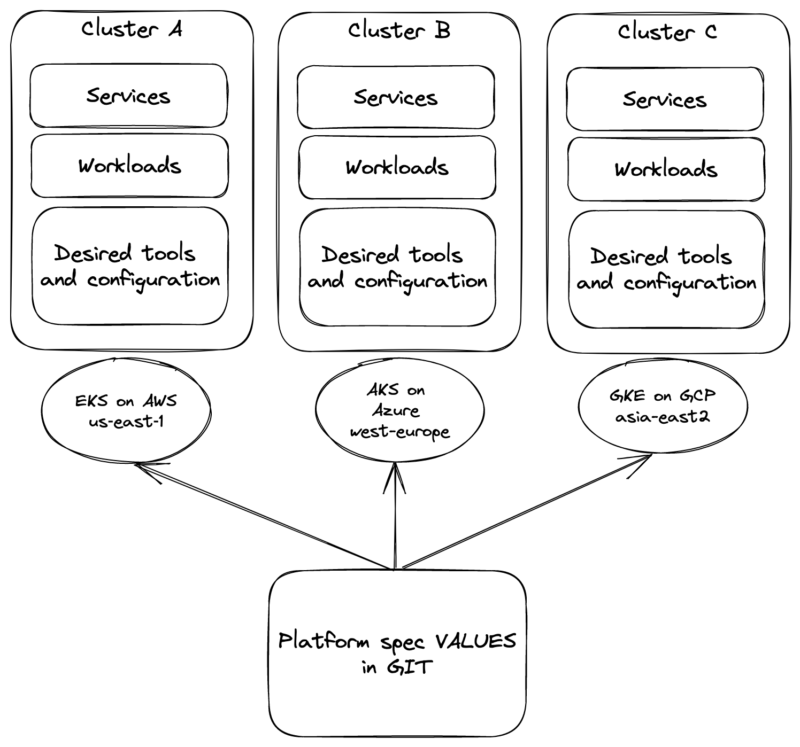

## Introduction

Edge computing is an approach where you run applications as close as possible to its data sources or end users. One of the benefits is improved response times. 

However, managing edge applications using Kubernetes comes with challenges, like:

- Deploy and update applications consistently accross multiple clusters
- Manage the run-time specifications for the applications like ingress, certificates, DNS, network policies, etc.
- Lifecycle management of all supporting tools
- Using managed Kubernetes services in different clouds/infrastructures

## How Otomi supports edge computing using Kubernetes

One of the benefits of Otomi is that everything managed by Otomi can be specified in a single values file. This enables you to not only define the applications workloads that need to be running on the cluster, but also all the required tools and configuration to support and secure the workloads.

Let's explain this with an example:

Suppose you have 2 application workloads that you would like to run on multiple Kubernetes clusters in multiple geographic regions, using different public cloud providers (AWS, Azure, GCP) and different Kubernetes versions (1.22 and 1.23). Next to the 2 workloads, you also would like to use Istio for mTLS, cert-manager for certificates, ingress/egress network policies for isolation and HTTP response headers. Because you can not afford using L7 load balancers with WAF features in the different clouds, you would like to implement Nginx ingress with Modsecurity and OWASP filtering. The following picture shows the desired situation:



For this example, you could create the following Otomi values profile and deploy it to all clusters:

```
cluster:
  k8sVersion: ${clusterVersion}
  name: ${clusterName}
  provider: ${clusterProvider}
otomi:
  adminPassword: ${password}
apps:
  argocd:
    enabled: true
  IngressNginx
    modsecurity:
      enabled: true
      owasp: true
  cert-manager:
    issuer: custom-ca
teamConfig:
  myapp:
    password: ${somePassword}
    id: myapp
    networkPolicy:
      egressPublic: true
      ingressPrivate: true
    services:
      - ingressClassName: platform
        name: front-end
        networkPolicy:
            ingressPrivate:
                mode: DenyAll
        ownHost: true
        port: 8080
        type: public
        headers:
          response:
            set:
              - name: Cache-Control
                value: no-store
              - name: Pragma
                value: no-cache
    services:
      - name: api
        networkPolicy:
            ingressPrivate:
                mode: AllowOnly
                allow:
                  team: myapp
                  service: front-end
        port: 8081
    workloads:
      - name: front-end
        url: https://myrepo.git
        path: front-end
        revision: HEAD
      - name: api
        url: https://myrepo.git
        path: api
        revision: HEAD
```


If Otomi is installed with these values using the Helm chart, Otomi will install and configure:

1. Nginx ingress with ModSecurity
2. Ingress resources
3. Istio (including the virtual services for public exposed services with HTTP response headers)
4. Network policies
5. Cert-manager
6. ArgoCD and ArgoCD applications to automatically deploy the front-end and api workloads


