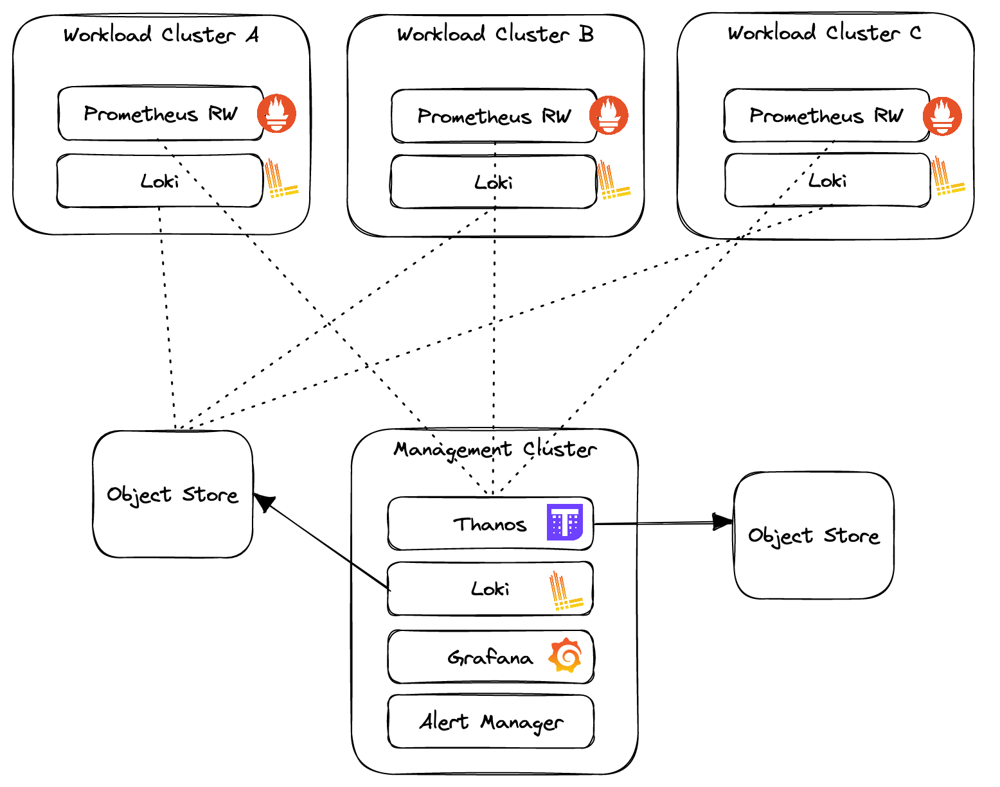

## Introduction

Using multiple Kubernetes clusters can have advantages based on your requirements. Some of the benefits of running multiple Kubernetes clusters are:

- High availability: When one cluster fails, the other cluster(s) can take the load. Losing one cluster when your applications are appropriately spread across several other clusters is much better than losing a single cluster with everything on it
- Better end user experience: Splitting workloads can improve performance and reduce latency by providing users with a geographically close environment
- Separate development and production clusters to reduce the risk of being served beta or non-production code versions

But from a technical perspective, managing multiple Kubernetes clusters is more complex than managing a single cluster. For effective multi-cluster management, a “single pane of glass” with centralized real-time monitoring, time series comparisons across and within clusters and high availability is essential for teams operating with multiple clusters and multiple providers.

## Multi-cluster observability with Otomi

The following image shows a multi-cluster observability setup using Otomi:

1. Aggregation of metrics from workload clusters for Prometheus high availability and single pane of glass
2. Multi-cluster log aggregation
3. Preconfigured multi-cluster dashboards
4. Multi-cluster alerting

This multi-cluster setup can be expanded with:

- Running Harbor on the management cluster to provide image and chart registries for the workload clusters
- Replicate workload cluster Git repositories to the management cluster Git repository
- Deploy multiple application clusters based on a single cluster profile

