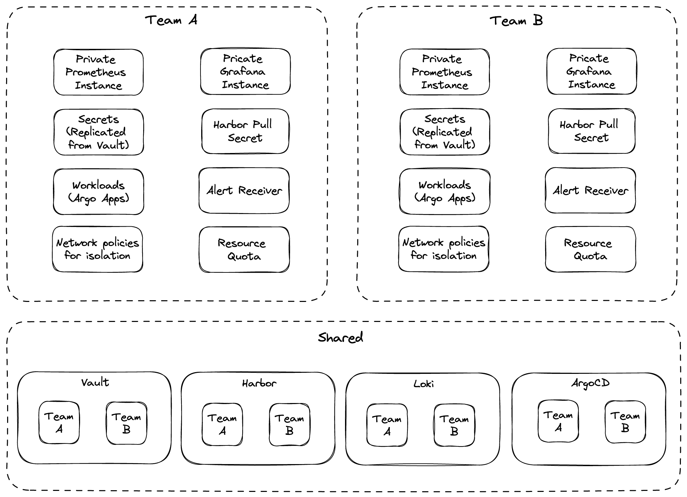

## Introduction

Multi-tenant Kubernetes clusters are shared by multiple users and/or workloads which are referred to as "tenants". Operators most commonly implement resource isolation in Kubernetes, using namespaces and resource quota. Probably the most known multi-tenant tool is [Capsule](https://github.com/clastix/capsule). But Capsule implements multi-tenancy on cluster API level only.

## Multi-tenancy in Otomi

Otomi goes a step higher up in the stack. Otomi does not only provide multi-tenancy on the K8s API level, but also for shared tools on the cluster. 

When multi-tenany in Otomi is activated (which is optional), Otomi will support the following features:

1. Teams are provided with a dedicated Prometheus instance for custom metrics (for metrics that should not be accessible for other tenants)
2. Teams are provided with a dedicated Grafana instance configured with authorization, alowing only authenticated tenant members to access dashboards
3. Container logs are separated in Loki combined with authorization, alowing only authenticated tenant members access to the tenants container logs
4. When Harbor is enabled, tenants will get access to a tenant project, alowing only authenticated tenant members to access tenant registries
5. When Vault is enabled, tenant will get access to a space in Vault, alowing only authenticated tenant members access to tenant secrets
6. When ArgoCD is enabled, tenants can only see the tenants ArgoCD applications created by Otomi
7. Tenants will get access to Gitea and can create their own Git repositories
8. Tenant namespaces are by default isolated for ingress and egress network traffic
9. Tenants can allow other tenants to access to their services
10. Tenant services that are publicly exposed can be configured with OIDC, only allowing tentants members to access the exposed services

## When to enable multi-tenancy in Otomi?

### Prevent cluster sprawl

As companies look to further harness the power of cloud-native, they are adopting container technologies at rapid speed, increasing the number of clusters and workloads. As the number of Kubernetes clusters grows, this is creating increased work for Platform teams. When it comes to patching security vulnerabilities or upgrading clusters, teams are doing five times the amount of work.

With Otomi you can support multi-tenancy, allowing multiple tenants (like multiple development teams) to work independently on the same cluster, while sharing all the tools. Now you only have to deploy a single development cluster to support multiple development teams. This prevents you from Kubernetes cluster sprawl.

### Fast onboarding of multiple tenants

When a new project starts, or when a new development team would like to start using Kubernetes, onboarding usually takes a lot of time. It's not only about providing development teams access to a Kubernetes namespace. No, developers also need access to an image registry, container logs, container metrics, alerts, secrets stores, container vulnerability reports and policy compliance reports.

With Otomi you can onboard development teams (tenants) in just a couple of minutes, allowing them to login to the self-service portal and:

- Get access to a private image registry
- Download the Docker login credentials to get access to their private image registry
- Deploy their images (stored in the private registry) using the Otomi workloads feature
- Get access to pre-configured dashboards to see container metrics, policy violations, detected threads in containers and detected vulnerabilities in containers
- Configure ingress and network policies
- Get access to Vault to create secrets
- Use secrets for ingress or workloads

When a team already has build an image, this image can be deployed within minutes after they have been onboarded.

