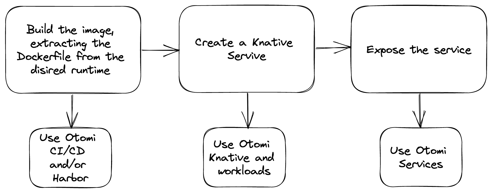

## Introduction

Knative is a platform that provides tools for deploying, running, and managing **serverless** cloud-native applications to Kubernetes. Knative brings together the scalability of Kubernetes and ease of development of serverless applications, giving you more control over the resources, and allowing you to focus on the application without worrying about the infrastructure.

Otomi includes Knative Serving as an optional tool. Otomi installs and configures the correct version of Knative based on the used Kubernetes version and integrates Knative into the Otomi ingress architecture. All you need to do after activating Knative is to deploy a Knative service.

## Creating Knative services

There are 2 ways to deploy Knative serverless workloads in Otomi:

1. Create a raw Knative service manifest and add it to the teams `-argocd` repository
2. Create a workload using a BYO helm chart

:::note
Otomi will soon provide Helm chart templates to create a Kubernetes Deployment (with HPA), a Kubernetes StatefullSet, a Kubernetes CronJob and/or a Knative Service. In this case you can use the wizard in Otomi to configure your values and Otomi will use the chart template and the values to automatically deploy the desired objects.
:::

## Migrating Lambda functions to Knative

A great way to migrate AWS Lambda functions to Kubernetes/Knative is to use [Triggermesh KLR](https://github.com/triggermesh/knative-lambda-runtime). KLR (pronounced clear) are Tekton Tasks that can be used to run an AWS Lambda function in a Kubernetes cluster installed with Knative.

Steps:

1. Activate Knative and ArgoCD in Otomi
2. Create a Dockerfile, extracting the from the desired [runtime](https://github.com/triggermesh/knative-lambda-runtime#run-in-docker)
3. Build and push the image (to the private repository in Harbor)
4. Create a Knative service
5. Expose the service publicly using Otomi

